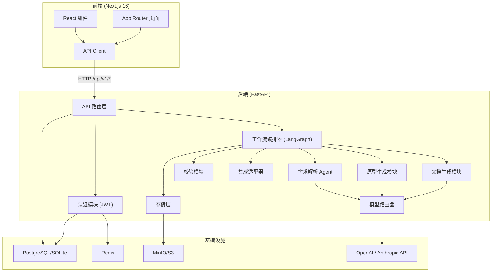
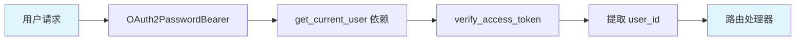
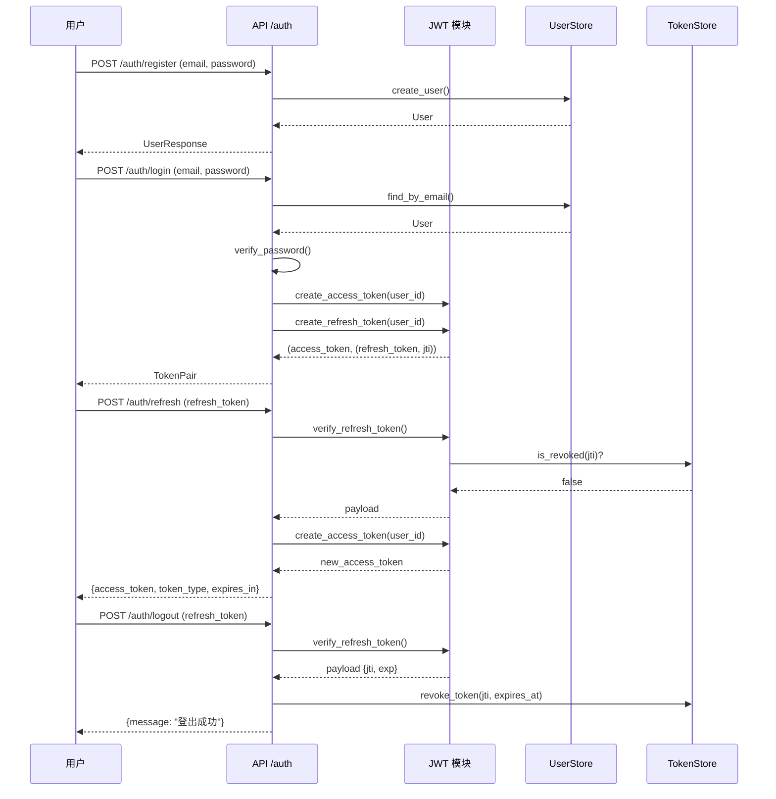
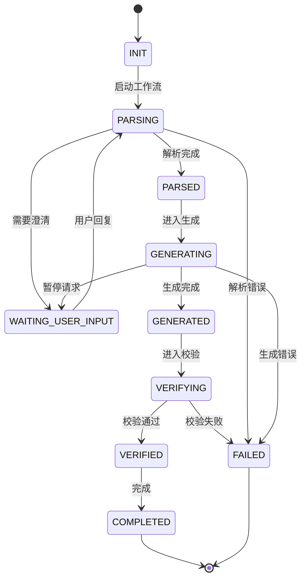
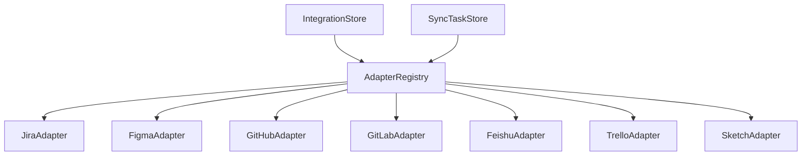
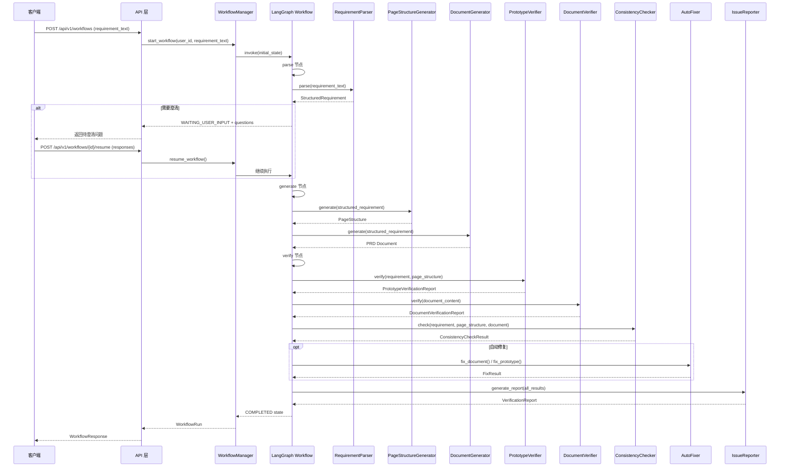
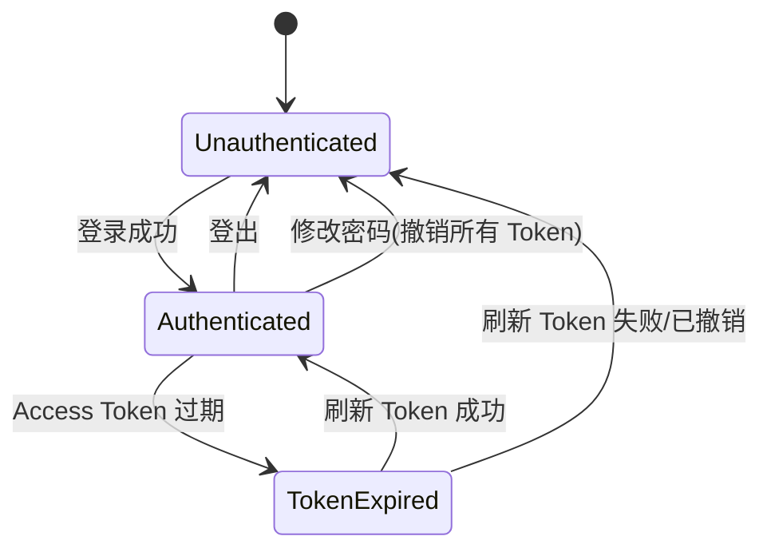
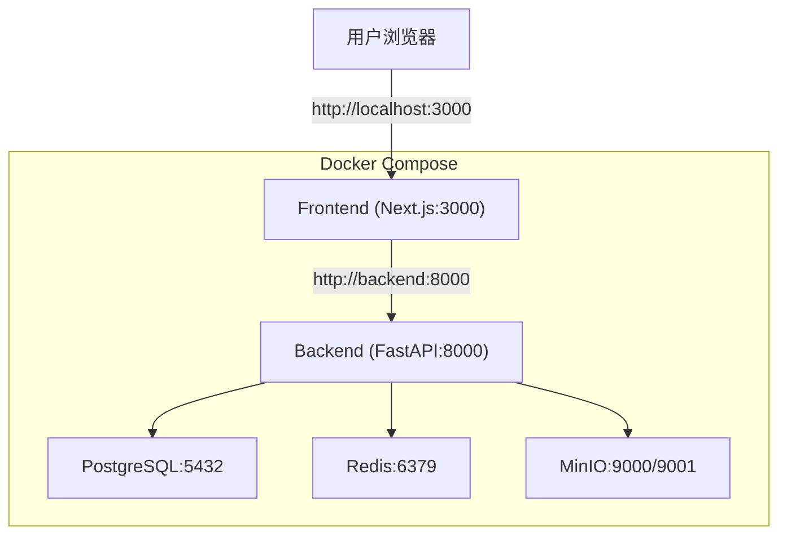

# 系统架构

## 架构概览

PM Workstation 采用前后端分离架构，后端基于 Python FastAPI 提供 RESTful API，前端基于 Next.js 16 App Router 构建用户界面。系统核心通过 LangGraph 状态机编排多个 AI Agent 协作完成需求到交付物的全流程。

## 分层架构

### 1. 表示层 (Presentation Layer)

**前端**: Next.js 16 App Router，使用 React 19 + TypeScript + TailwindCSS 4

| 页面路由 | 功能 |
|---------|------|
| `/workflows` | 工作流管理（创建、查看、暂停、恢复） |
| `/requirements` | 需求解析结果展示 |
| `/prototypes` | 原型预览和编辑 |
| `/documents` | PRD 文档查看 |
| `/integrations` | 外部系统集成配置 |
| `/reports` | 校验报告查看 |
| `/components-lib` | 组件库浏览 |

### 2. API 层 (API Layer)

FastAPI 应用通过路由组组织，所有业务 API 均挂载在 `/api/v1` 前缀下：

| 路由前缀 | 模块 | 认证要求 |
|---------|------|---------|
| `/api/v1/auth/*` | 认证（注册、登录、刷新、登出、改密） | 公开/部分需认证 |
| `/api/v1/workflows/*` | 工作流管理 | 需要 JWT |
| `/api/v1/components/*` | 组件库 | 需要 JWT |
| `/api/v1/integrations/*` | 集成配置和同步任务 | 需要 JWT |
| `/health` | 健康检查 | 公开 |

应用通过 `create_app()` 工厂函数创建，使用 lifespan 管理 `WorkflowManager` 的生命周期。

### 3. 业务逻辑层 (Business Logic Layer)

#### 3.1 认证模块 (`auth/`)

基于 JWT 的双 Token 机制：

**核心组件**:

- **JWT 工具** (`jwt.py`): Token 签发（access/refresh）、解码、验证
- **UserStore** (`user_store.py`): 用户 CRUD，bcrypt 密码哈希
- **TokenStore** (`token_store.py`): Refresh Token 撤销黑名单（内存实现，生产应使用 Redis）
- **认证依赖** (`dependencies.py`): `get_current_user`（强制认证）、`get_current_user_optional`（可选认证）

**Token 流程**:

#### 3.2 工作流编排层 (`orchestrator/`)

基于 LangGraph StateGraph 实现的状态机，定义完整的工作流生命周期：

**核心组件**:

- **WorkflowState** (`workflow_state.py`): LangGraph 状态，携带工作流运行记录、结构化需求、原型 HTML、PRD 文档、校验报告等
- **WorkflowNodes** (`workflow_graph.py`): 定义 parse/generate/verify/complete/handle_user_input 五个节点
- **WorkflowManager** (`workflow_manager.py`): 高层管理接口，提供 start/pause/resume/list/get_deliverables 等操作

#### 3.3 需求解析层 (`agents/`)

通过 LLM 从自然语言需求文本中提取结构化信息：

- **RequirementParser**: 主解析器，调用 LLM 提取业务实体、用户角色、操作流程、业务规则树、边界场景、澄清问题
- 子分析器: `entity_extractor`, `role_identifier`, `rule_decomposer`, `branch_analyzer`, `gap_detector`, `clarification_generator`, `reasoning_tracer`

#### 3.4 原型生成层 (`prototype/`)

- **PageStructureGenerator**: 从结构化需求生成页面结构树（PageNode 层级）
- **ComponentMatcher**: 根据页面需求匹配组件库中的组件
- **HTMLGenerator**: 生成 HTML/CSS/JS 原型代码
- **InteractionConfigurator**: 配置页面交互逻辑

#### 3.5 文档生成层 (`document/`)

- **ContentGenerator**: 基于结构化需求生成 PRD 内容
- **StructureGenerator**: 生成文档结构骨架
- **MarkdownFormatter**: Markdown 格式化和标题提取
- **TemplateEngine**: 文档模板渲染
- **TerminologyChecker**: 术语一致性检查

#### 3.6 校验层 (`verification/`)

多维度校验体系：

```mermaid
graph TB
    subgraph Prototype["原型校验"]
        P1["PageCoverageChecker: 页面覆盖率"]
        P2["InteractionVerifier: 交互逻辑"]
        P3["导航完整性检查"]
    end

    subgraph Document["文档校验"]
        D1["DocumentFormatChecker: 格式规范"]
        D2["DocumentStructureChecker: 结构完整性"]
        D3["TerminologyConsistencyChecker: 术语一致性"]
    end

    subgraph Consistency["一致性检查"]
        C1["实体覆盖一致性"]
        C2["流程覆盖一致性"]
        C3["术语使用一致性"]
        C4["页面-文档对齐"]
    end

    subgraph AutoFix["自动修复"]
        F1["空链接移除"]
        F2["代码块闭合"]
        F3["表格分隔行修复"]
        F4["标题层级修正"]
        F5["断裂导航链接修复"]
    end

    P1 --> R["IssueReporter: 综合报告"]
    P2 --> R
    D1 --> R
    D2 --> R
    C1 --> R
    C2 --> R
    F1 --> R
    F2 --> R
```

#### 3.7 模型路由层 (`model_router/`)

- **LLMBackend**: 抽象基类，定义 chat/chat_stream 接口
- **OpenAIAdapter / AnthropicAdapter**: 具体实现
- **FallbackHandler**: 模型故障时自动降级到备用模型
- **ModelSelector**: 根据任务类型选择最优模型
- **CostOptimizer**: 成本优化策略
- **TaskClassifier**: 任务分类器

#### 3.8 集成层 (`integrations/`)

适配器模式实现外部系统集成：

- **IntegrationConfig**: 集成配置模型（API 端点、密钥、Token）
- **SyncTask**: 同步任务模型（支持 import/export/bidirectional）
- **IntegrationStore / SyncTaskStore**: 内存存储（生产应使用数据库）

#### 3.9 存储层 (`storage/`)

- **StorageBackend**: 抽象接口（upload/download/delete/get_url/exists）
- **LocalStorage**: 本地文件系统实现
- **MinioStorage**: MinIO/S3 对象存储实现
- **StorageFactory**: 根据配置类型创建对应存储后端

### 4. 数据层 (Data Layer)

| 存储 | 用途 | 实现 |
|-----|------|------|
| PostgreSQL/SQLite | 用户数据、工作流元数据 | SQLAlchemy 2.0 ORM |
| Redis | Token 撤销、缓存、消息队列 | redis-py |
| MinIO/S3 | 交付物存储（原型 HTML、PRD 文档） | minio-py / boto3 |
| 内存字典 | 工作流运行记录、集成配置、组件库 | Python dict |

## 数据流

### 完整工作流数据流

## 认证架构

### JWT Token 机制

系统采用 Access Token + Refresh Token 双 Token 机制：

| Token 类型 | 有效期 | 用途 | 撤销机制 |
|-----------|--------|------|---------|
| Access Token | 15 分钟 | API 请求认证 | 过期自动失效 |
| Refresh Token | 7 天 | 获取新的 Access Token | JTI 黑名单 |

**安全特性**:

- 密码使用 bcrypt 哈希存储（限制最大 72 字节）
- Refresh Token 包含唯一 JTI（JWT ID）用于撤销
- 登出时将 Refresh Token 的 JTI 加入黑名单
- 修改密码时撤销所有已签发的 Refresh Token
- 密码长度要求 8-128 字符

**认证流程状态图**:

## 部署架构

各服务通过 `pm-network` 桥接网络通信，数据库和 Redis 配置了健康检查确保启动顺序。
