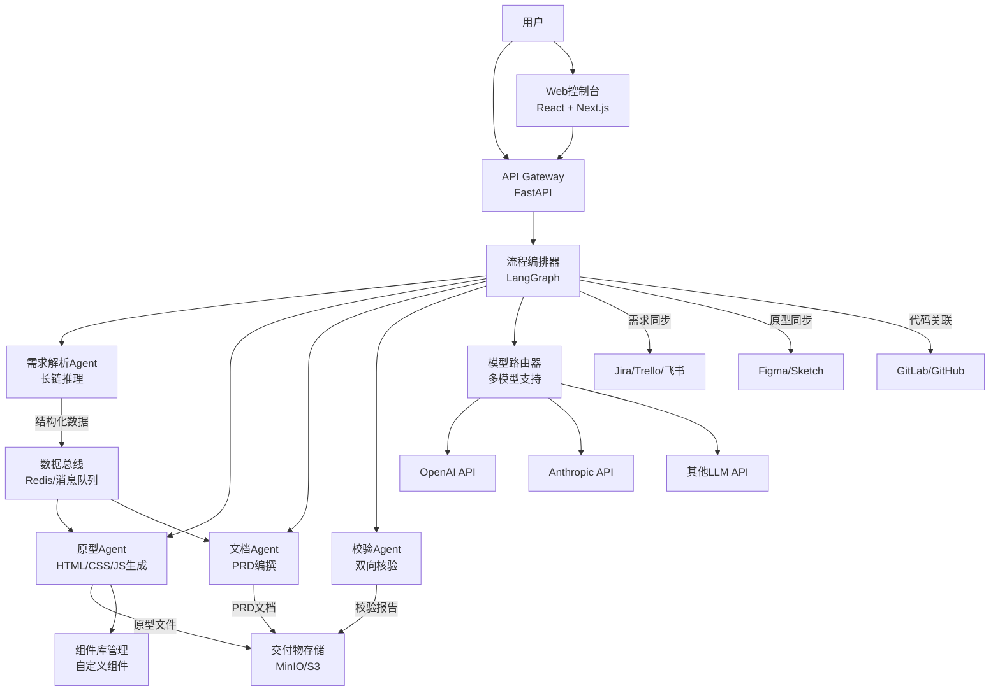

# 产品经理多Agent协作工作站 - 技术设计文档

Feature Name: 2026-05-04-pm-workstation-multi-agent
Updated: 2026-05-04

## Description

本系统是一个基于Python + LangChain的产品经理个人工作站，采用多Agent协作+长链推理核心方案。系统包含需求解析Agent、原型Agent、文档Agent和校验Agent四个核心智能代理，覆盖需求解析、原型绘制、文档编撰、校验纠错全流程。系统输出HTML/CSS/JS可交互原型和标准化PRD文档，支持与项目管理工具、设计工具、代码仓库等外部系统集成。

## Architecture



## Components and Interfaces

### 1. 流程编排器 (Workflow Orchestrator)

**职责**: 使用LangGraph编排多Agent协作流程，管理状态流转和任务分发

**接口**:
- `start_workflow(requirement_text: str) -> WorkflowRun`: 启动需求处理流程
- `get_workflow_status(run_id: str) -> WorkflowStatus`: 查询流程状态
- `pause_workflow(run_id: str)`: 暂停流程
- `resume_workflow(run_id: str)`: 恢复流程
- `get_deliverables(run_id: str) -> Deliverables`: 获取交付物

**状态机**:
```
INIT -> PARSING -> PARSED -> GENERATING -> GENERATED -> VERIFYING -> VERIFIED -> COMPLETED
                              |-> FAILED (任一环节失败)
                              |-> WAITING_USER_INPUT (需要用户确认)
```

### 2. 需求解析Agent (Requirement Analysis Agent)

**职责**: 使用长链推理能力解析碎片化需求，输出结构化业务逻辑数据

**核心组件**:
- `RequirementParser`: 需求文本解析器，提取业务实体、角色、操作流程
- `RuleDecomposer`: 业务规则拆解器，生成规则树
- `BranchAnalyzer`: 操作分支分析器，梳理正常/异常/边界场景
- `GapDetector`: 逻辑疏漏检测器，标记考虑不全的场景
- `ClarificationGenerator`: 澄清问题生成器

**输出数据结构**:
```python
@dataclass
class StructuredRequirement:
    entities: list[BusinessEntity]  # 业务实体
    roles: list[Role]               # 用户角色
    rules: RuleTree                 # 业务规则树
    flows: list[UserFlow]          # 用户操作流程
    branches: list[Branch]         # 操作分支（正常/异常/边界）
    edge_cases: list[EdgeCase]     # 边界场景
    clarifications: list[Question] # 待澄清问题
    reasoning_trace: str           # 推理路径记录
```

### 3. 原型Agent (Prototype Generation Agent)

**职责**: 根据结构化需求生成HTML/CSS/JS可交互原型

**核心组件**:
- `PageStructureGenerator`: 页面结构生成器
- `ComponentMatcher`: 组件匹配器，从组件库查找匹配组件
- `InteractionConfigurator`: 交互配置器，配置页面跳转和交互逻辑
- `StyleConsistencyChecker`: 样式一致性检查器
- `HTMLGenerator`: HTML/CSS/JS代码生成器

**组件库接口**:
- `upload_component(component: Component) -> ComponentID`
- `search_component(criteria: ComponentCriteria) -> list[Component]`
- `get_component_versions(component_id: ComponentID) -> list[Version]`
- `delete_component(component_id: ComponentID) -> ImpactAnalysis`

### 4. 文档Agent (Documentation Generation Agent)

**职责**: 根据结构化需求自动生成标准化PRD文档

**核心组件**:
- `DocumentStructureGenerator`: 文档结构生成器
- `TemplateEngine`: PRD模板引擎
- `ContentGenerator`: 内容生成器
- `TerminologyConsistencyChecker`: 术语一致性检查器
- `MarkdownFormatter`: Markdown格式化工具

**输出格式**: Markdown格式的PRD文档，包含需求背景、用户故事、功能描述、业务规则、交互说明等标准章节。

### 5. 校验Agent (Verification Agent)

**职责**: 对原型和文档进行双向核验，修复逻辑漏洞，统一输出规范

**核心组件**:
- `PrototypeVerifier`: 原型交互逻辑检查器
- `DocumentVerifier`: 文档内容格式检查器
- `ConsistencyChecker`: 原型-文档一致性检查器
- `AutoFixer`: 自动修复器
- `IssueReporter`: 问题报告生成器

**校验规则**:
- 原型页面覆盖所有用户流程
- 原型交互逻辑与业务规则一致
- PRD文档格式符合模板规范
- PRD文档内容与原型实现一致
- 术语使用前后一致

### 6. 模型路由器 (Model Router)

**职责**: 根据任务类型自动选择最优LLM模型，支持降级和重试

**核心组件**:
- `TaskClassifier`: 任务分类器，判断任务复杂度和类型
- `ModelSelector`: 模型选择器，根据任务选择最优模型
- `FallbackHandler`: 降级处理器，模型失败时切换备选模型
- `CostOptimizer`: 成本优化器，平衡效果和成本

**支持模型**:
- OpenAI GPT-4/GPT-4o
- Anthropic Claude 3
- 其他可扩展模型

### 7. 外部系统集成 (External System Integrations)

**项目管理工具集成**:
- Jira API Adapter
- Trello API Adapter
- 飞书开放平台 API Adapter

**设计工具集成**:
- Figma REST API Adapter
- Sketch File Format Adapter

**代码仓库集成**:
- GitLab API Adapter
- GitHub API Adapter

### 8. Web控制台 (Web Dashboard)

**技术栈**: React + Next.js + TypeScript

**核心页面**:
- 需求输入页：输入碎片化需求描述
- 流程监控页：实时查看流程执行进度和状态
- 原型预览页：在线预览和交互测试生成的原型
- 文档查看页：查看和编辑生成的PRD文档
- 校验报告页：查看校验结果和修复建议
- 组件库管理页：上传、搜索、管理自定义组件
- 集成配置页：配置外部系统连接

## Data Models

### 工作流运行记录 (WorkflowRun)
```python
@dataclass
class WorkflowRun:
    id: str                          # 唯一标识
    user_id: str                     # 用户ID
    requirement_text: str            # 原始需求文本
    status: WorkflowStatus           # 当前状态
    created_at: datetime             # 创建时间
    updated_at: datetime             # 更新时间
    structured_requirement: Optional[StructuredRequirement]
    prototype_url: Optional[str]     # 原型访问URL
    prd_document_url: Optional[str]  # PRD文档URL
    verification_report: Optional[VerificationReport]
```

### 业务实体 (BusinessEntity)
```python
@dataclass
class BusinessEntity:
    name: str                        # 实体名称
    description: str                 # 描述
    attributes: list[Attribute]      # 属性列表
    relationships: list[Relationship] # 关联关系
```

### 业务规则树 (RuleTree)
```python
@dataclass
class RuleTreeNode:
    rule_text: str                   # 规则描述
    conditions: list[Condition]      # 条件列表
    actions: list[Action]            # 执行动作
    children: list[RuleTreeNode]     # 子规则
    depth: int                       # 规则深度
```

### 用户流程 (UserFlow)
```python
@dataclass
class UserFlow:
    name: str                        # 流程名称
    role: str                        # 执行角色
    steps: list[FlowStep]           # 流程步骤
    branches: list[Branch]          # 分支流程
    entry_point: str                 # 入口点
    exit_points: list[str]           # 出口点
```

### 组件 (Component)
```python
@dataclass
class Component:
    id: str                          # 组件ID
    name: str                        # 组件名称
    version: str                     # 版本号
    html_template: str               # HTML模板
    css_styles: str                  # CSS样式
    js_interactions: str             # JS交互逻辑
    props: dict                      # 属性定义
    tags: list[str]                  # 标签
    created_at: datetime             # 创建时间
```

## Correctness Properties

### 不变量
1. **数据一致性**: 原型、文档、校验报告必须基于同一份结构化需求数据
2. **流程完整性**: 工作流必须按照 INIT -> PARSING -> GENERATING -> VERIFYING -> COMPLETED 顺序执行
3. **组件版本锁定**: 原型生成时使用的组件版本必须记录并可追溯
4. **推理可追溯**: 需求解析的推理路径必须完整记录，支持回溯审查

### 约束条件
1. **推理深度**: 需求解析Agent支持至少5层业务规则深度拆解
2. **模型可用性**: 至少配置2个可用LLM模型，确保降级能力
3. **并发限制**: 单个用户最多同时运行3个工作流
4. **存储配额**: 单个交付物包最大100MB

## Error Handling

### 错误场景与处理策略

| 错误场景 | 处理策略 | 用户通知 |
|---------|---------|---------|
| LLM API调用失败 | 自动降级到备选模型，最多重试3次 | 显示降级提示 |
| 外部系统API超时 | 异步重试，最多5次，指数退避 | 显示同步延迟 |
| 组件库匹配失败 | 生成基础组件，标记待优化 | 提示用户审查 |
| 需求解析发现歧义 | 暂停流程，生成澄清问题 | 请求用户回答 |
| 校验发现不一致 | 自动修复可修复项，标记需人工项 | 显示校验报告 |
| 存储配额不足 | 清理过期交付物，提示用户升级 | 显示配额警告 |
| 并发限制超限 | 排队等待，显示队列位置 | 显示排队状态 |

### 重试机制
- **指数退避**: 初始间隔1秒，最大间隔60秒
- **最大重试次数**: 3次（LLM调用），5次（外部系统）
- **失败保存**: 保存中间状态，支持断点续传

### 用户介入点
1. 需求解析后：审查结构化需求，补充缺失信息
2. 澄清问题：回答Agent提出的歧义问题
3. 组件优化：优化自动生成的基础组件
4. 校验修复：处理无法自动修复的校验问题

## Test Strategy

### 单元测试
- **需求解析Agent**: 测试需求文本解析、规则拆解、分支分析、疏漏检测
- **原型Agent**: 测试组件匹配、页面生成、交互配置、样式一致性
- **文档Agent**: 测试文档结构生成、模板渲染、术语一致性
- **校验Agent**: 测试原型验证、文档验证、一致性检查、自动修复

### 集成测试
- **工作流编排**: 测试完整流程从INIT到COMPLETED的状态流转
- **多模型路由**: 测试模型选择、降级切换、重试机制
- **外部系统集成**: 测试Jira/Figma/GitHub等系统的API调用和数据同步
- **组件库管理**: 测试组件上传、搜索、版本管理、删除影响分析

### 端到端测试
- **完整流程**: 输入需求 -> 解析 -> 生成原型+文档 -> 校验 -> 输出交付物
- **异常流程**: 测试各环节失败后的降级、重试、用户介入
- **并发测试**: 测试多用户同时运行工作流的隔离性和性能

### 性能测试
- **推理性能**: 长链推理响应时间 < 30秒（5层深度）
- **生成性能**: 原型+文档生成时间 < 60秒
- **并发性能**: 支持100并发用户，P95响应时间 < 5秒

### 安全测试
- **API认证**: JWT token验证，角色权限控制
- **数据隔离**: 多租户数据隔离，用户只能访问自己的交付物
- **模型密钥保护**: LLM API密钥加密存储，不在日志中暴露

## References

[^1]: (Website) - [LangChain Documentation](https://python.langchain.com/docs/)
[^2]: (Website) - [LangGraph Documentation](https://langchain-ai.github.io/langgraph/)
[^3]: (Website) - [OpenAI API Documentation](https://platform.openai.com/docs/)
[^4]: (Website) - [Anthropic Claude Documentation](https://docs.anthropic.com/)
[^5]: (Website) - [FastAPI Documentation](https://fastapi.tiangolo.com/)
[^6]: (Website) - [Next.js Documentation](https://nextjs.org/docs)
