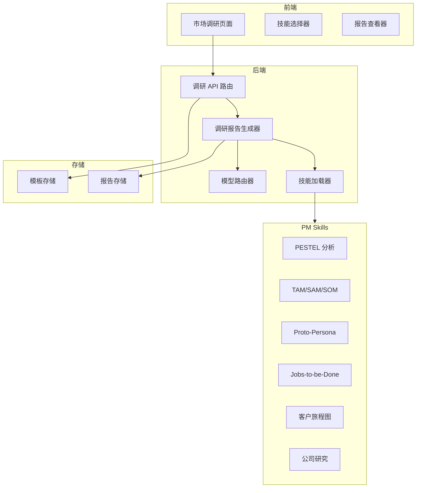
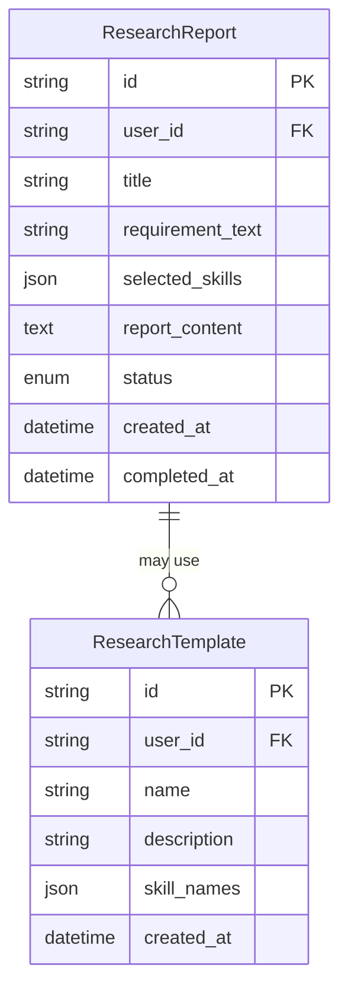
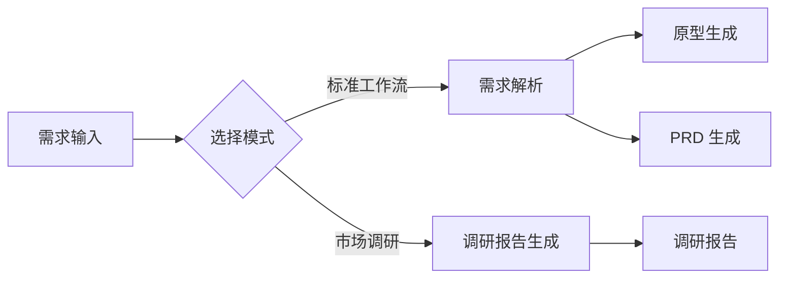

# 市场调研模块技术设计

Feature Name: market-research-module
Updated: 2026-05-08

## 描述

市场调研模块为产品经理提供基于 PM Skills 的市场调研报告生成能力。用户输入调研需求后，系统智能推荐相关 Skills（如 PESTEL、TAM/SAM/SOM、客户画像等），并调用 LLM 生成结构化的调研报告。

## 架构



## 组件和接口

### 1. 前端组件

#### MarketResearchPage (`frontend/src/app/market-research/page.tsx`)

```typescript
interface MarketResearchPageProps {
  // 主页面，包含创建表单和历史列表
}

interface ResearchFormData {
  title: string;
  requirement_text: string;
  selected_skills: string[];
  template_id?: string;
}
```

#### SkillRecommendationPanel

根据用户输入的调研需求，智能推荐相关 PM Skills。

```typescript
interface SkillRecommendation {
  name: string;
  description: string;
  relevance_score: number;
  category: 'macro' | 'market' | 'customer' | 'competitor' | 'strategy';
}
```

### 2. 后端组件

#### MarketResearchRouter (`src/pm_workstation/api/routes/market_research.py`)

```python
router = APIRouter(prefix="/market-research", tags=["市场调研"])

@router.post("/create")
async def create_research(
    request: CreateResearchRequest,
    user_id: str = Depends(get_current_user)
) -> ResearchTaskResponse:
    """创建调研任务"""

@router.get("/list")
async def list_researches(
    user_id: str = Depends(get_current_user)
) -> list[ResearchSummary]:
    """获取调研报告列表"""

@router.get("/{research_id}")
async def get_research(
    research_id: str,
    user_id: str = Depends(get_current_user)
) -> ResearchDetail:
    """获取调研报告详情"""

@router.get("/{research_id}/status")
async def get_research_status(
    research_id: str
) -> TaskStatus:
    """获取任务执行状态"""
```

#### MarketResearchAgent (`src/pm_workstation/agents/market_research_agent.py`)

```python
class MarketResearchAgent:
    """市场调研报告生成器"""

    def __init__(self, llm_handler: LLMBackend | FallbackHandler):
        self.llm_handler = llm_handler
        self.skill_loader = SkillLoader()

    async def generate_report(
        self,
        requirement_text: str,
        selected_skills: list[str],
        callback: Callable | None = None
    ) -> str:
        """
        生成市场调研报告

        Args:
            requirement_text: 调研需求描述
            selected_skills: 选中的 PM Skills 名称列表
            callback: 进度回调函数

        Returns:
            Markdown 格式的调研报告
        """

    async def _generate_skill_section(
        self,
        skill: Skill,
        requirement_text: str
    ) -> str:
        """生成单个技能对应的报告章节"""

    def _recommend_skills(self, requirement_text: str) -> list[SkillRecommendation]:
        """根据需求文本推荐相关技能"""

    def _build_report_structure(
        self,
        sections: dict[str, str]
    ) -> str:
        """组装完整的报告结构"""
```

### 3. 数据模型

#### CreateResearchRequest

```python
class CreateResearchRequest(BaseModel):
    title: str = Field(..., description="调研标题")
    requirement_text: str = Field(..., description="调研需求描述")
    selected_skills: list[str] = Field(default_factory=list, description="选中的技能列表")
    template_id: str | None = Field(None, description="使用的模板 ID")
```

#### ResearchReport

```python
class ResearchReport(BaseModel):
    id: str
    user_id: str
    title: str
    requirement_text: str
    selected_skills: list[str]
    report_content: str  # Markdown 格式
    status: TaskStatus
    created_at: datetime
    completed_at: datetime | None
```

#### ResearchTemplate

```python
class ResearchTemplate(BaseModel):
    id: str
    user_id: str
    name: str
    description: str
    skill_names: list[str]
    created_at: datetime
```

## 数据模型



## 正确性属性

1. **技能调用完整性**: 选中的每个 Skill 都必须被调用并生成对应章节
2. **报告结构一致性**: 报告章节顺序应与用户选择的技能顺序一致
3. **用户隔离**: 用户只能访问自己创建的调研报告和模板

## 错误处理

| 错误场景 | 处理策略 |
|---------|---------|
| Skill 加载失败 | 跳过该 Skill，在报告中标注"生成失败" |
| LLM 调用超时 | 重试 2 次，仍失败则回退到模板生成 |
| 无效的技能名称 | 返回 400 错误，提示可用的技能列表 |
| 并发任务超限 | 返回 429 错误，提示稍后重试 |

## 测试策略

1. **单元测试**:
   - 测试 `_recommend_skills` 推荐准确性
   - 测试 `_build_report_structure` 组装逻辑
   - 测试各 Skill 的提示词构建

2. **集成测试**:
   - 测试完整的报告生成流程
   - 测试 API 路由的认证和授权
   - 测试并发任务处理

3. **端到端测试**:
   - 测试前端创建调研 → 后端生成 → 前端展示的完整流程

## 与现有系统的集成

### 与工作流模块的关系

市场调研模块可以作为工作流的一个独立节点，也可以作为独立功能使用：



### 与 PM Skills 的关系

市场调研模块复用现有的 SkillLoader 加载 PM Skills，无需额外的技能定义。

## 实现计划

### Phase 1: 后端实现
1. 创建 `MarketResearchAgent`
2. 创建 `market_research.py` API 路由
3. 添加数据模型到 `schemas.py`

### Phase 2: 前端实现
1. 创建 `/market-research` 页面
2. 实现技能推荐组件
3. 实现报告查看组件

### Phase 3: 模板功能
1. 添加模板 CRUD API
2. 前端模板管理界面
