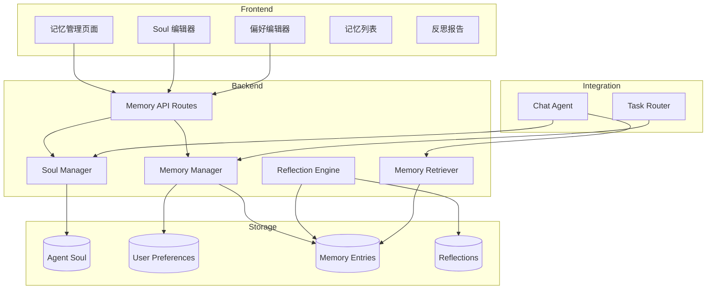

# Agent Long-Term Memory - Technical Design

Feature Name: agent-long-term-memory
Updated: 2026-05-09

## Description

本功能为 AI Agent 实现长期记忆系统，包括 Agent Soul 定义、用户偏好管理、经验记忆存储、记忆检索与应用、定期反思与学习等功能。

## Architecture



## Components and Interfaces

### 1. Data Models

#### AgentSoul

```python
class AgentSoul(BaseModel):
    id: str
    user_id: str
    name: str  # Soul 名称
    personality: str  # 性格特征
    values: list[str]  # 价值观
    behavior_rules: list[str]  # 行为准则
    communication_style: str  # 沟通风格
    expertise_areas: list[str]  # 专业领域
    created_at: datetime
    updated_at: datetime
    is_active: bool = True
```

#### UserPreference

```python
class UserPreference(BaseModel):
    id: str
    user_id: str
    category: str  # 偏好分类
    key: str  # 偏好键
    value: str  # 偏好值
    description: Optional[str] = None
    created_at: datetime
    updated_at: datetime
```

#### MemoryEntry

```python
class MemoryEntry(BaseModel):
    id: str
    user_id: str
    memory_type: MemoryType  # soul/preference/experience/mistake/learning
    content: str  # 记忆内容
    summary: str  # 摘要
    tags: list[str]  # 标签
    importance: float  # 重要性评分 0-1
    source: str  # 来源（会话ID、任务ID等）
    context: dict = {}  # 上下文信息
    created_at: datetime
    last_accessed: datetime
    access_count: int = 0
```

#### Reflection

```python
class Reflection(BaseModel):
    id: str
    user_id: str
    period_start: datetime
    period_end: datetime
    total_tasks: int
    successful_tasks: int
    failed_tasks: int
    key_learnings: list[str]
    improvement_areas: list[str]
    action_items: list[str]
    created_at: datetime
```

### 2. Backend Components

#### Memory Manager (`src/pm_workstation/memory/memory_manager.py`)

```python
class MemoryManager:
    async def add_memory(self, memory: MemoryEntry) -> MemoryEntry
    async def get_memory(self, memory_id: str) -> MemoryEntry
    async def list_memories(self, user_id: str, memory_type: Optional[MemoryType] = None) -> list[MemoryEntry]
    async def update_memory(self, memory_id: str, updates: dict) -> MemoryEntry
    async def delete_memory(self, memory_id: str) -> bool
    async def search_memories(self, user_id: str, query: str, limit: int = 10) -> list[MemoryEntry]
    async def get_relevant_memories(self, user_id: str, context: str, limit: int = 5) -> list[MemoryEntry]
```

#### Soul Manager (`src/pm_workstation/memory/soul_manager.py`)

```python
class SoulManager:
    async def get_active_soul(self, user_id: str) -> Optional[AgentSoul]
    async def create_soul(self, soul: AgentSoul) -> AgentSoul
    async def update_soul(self, soul_id: str, updates: dict) -> AgentSoul
    async def list_souls(self, user_id: str) -> list[AgentSoul]
    async def activate_soul(self, soul_id: str) -> bool
    def build_soul_prompt(self, soul: AgentSoul) -> str
```

#### Reflection Engine (`src/pm_workstation/memory/reflection_engine.py`)

```python
class ReflectionEngine:
    async def check_reflection_trigger(self, user_id: str) -> bool
    async def execute_reflection(self, user_id: str) -> Reflection
    async def analyze_patterns(self, memories: list[MemoryEntry]) -> dict
    async def generate_learnings(self, analysis: dict) -> list[str]
    async def get_latest_reflection(self, user_id: str) -> Optional[Reflection]
```

#### Memory Retriever (`src/pm_workstation/memory/memory_retriever.py`)

```python
class MemoryRetriever:
    async def retrieve_for_context(self, user_id: str, context: str) -> list[MemoryEntry]
    async def build_memory_prompt(self, memories: list[MemoryEntry]) -> str
    def calculate_relevance(self, memory: MemoryEntry, context: str) -> float
```

### 3. API Routes

```
POST   /api/v1/memory/soul                    # 创建 Soul
GET    /api/v1/memory/soul                    # 获取当前 Soul
PUT    /api/v1/memory/soul/{id}               # 更新 Soul
GET    /api/v1/memory/soul/list               # 列出所有 Soul
POST   /api/v1/memory/soul/{id}/activate      # 激活 Soul

POST   /api/v1/memory/preferences             # 创建偏好
GET    /api/v1/memory/preferences             # 获取所有偏好
PUT    /api/v1/memory/preferences/{id}        # 更新偏好
DELETE /api/v1/memory/preferences/{id}        # 删除偏好

POST   /api/v1/memory/entries                 # 创建记忆
GET    /api/v1/memory/entries                 # 列出记忆
GET    /api/v1/memory/entries/{id}            # 获取记忆详情
PUT    /api/v1/memory/entries/{id}            # 更新记忆
DELETE /api/v1/memory/entries/{id}            # 删除记忆
GET    /api/v1/memory/search                  # 搜索记忆

POST   /api/v1/memory/reflect                 # 触发反思
GET    /api/v1/memory/reflections             # 获取反思记录
GET    /api/v1/memory/reflections/latest      # 获取最新反思
```

### 4. Frontend Components

#### MemoryPage (`frontend/src/app/memory/page.tsx`)

主记忆管理页面，包含 Soul 编辑、偏好管理、记忆列表、反思报告等标签页。

#### SoulEditor (`frontend/src/components/memory/SoulEditor.tsx`)

Agent Soul 编辑器，支持定义个性、价值观、行为准则等。

#### PreferenceManager (`frontend/src/components/memory/PreferenceManager.tsx`)

用户偏好管理组件，支持增删改查偏好设置。

#### MemoryList (`frontend/src/components/memory/MemoryList.tsx`)

记忆列表组件，支持按类型筛选、搜索、编辑和删除。

#### ReflectionReport (`frontend/src/components/memory/ReflectionReport.tsx`)

反思报告展示组件，显示反思结果和改进建议。

## Correctness Properties

1. **记忆隔离**: 每个用户的记忆相互独立，不可跨用户访问
2. **Soul 唯一性**: 每个用户同时只能有一个激活的 Soul
3. **记忆去重**: 相同内容的记忆不应重复存储
4. **时间一致性**: 记忆的创建时间和访问时间必须准确记录

## Error Handling

1. **存储失败**: 返回友好错误提示，建议用户重试
2. **记忆检索失败**: 返回空列表，不影响正常会话
3. **反思执行失败**: 记录错误日志，下次触发时重试
4. **Soul 格式错误**: 提供格式校验和错误提示

## Test Strategy

1. **单元测试**: 测试各个 Manager 和 Engine 的核心逻辑
2. **集成测试**: 测试记忆检索和应用流程
3. **端到端测试**: 测试完整的记忆管理流程
4. **性能测试**: 测试大量记忆下的检索性能

## Implementation Plan

### Phase 1: 基础记忆存储
- 创建数据模型
- 实现 Memory Manager
- 实现基础 API Routes

### Phase 2: Soul 和偏好管理
- 实现 Soul Manager
- 实现偏好管理功能
- 集成到会话系统

### Phase 3: 记忆检索与应用
- 实现 Memory Retriever
- 集成到 Chat Agent
- 实现上下文记忆注入

### Phase 4: 反思与学习
- 实现 Reflection Engine
- 实现反思触发机制
- 生成反思报告

### Phase 5: 前端界面
- 实现记忆管理页面
- 实现 Soul 编辑器
- 实现偏好管理界面
