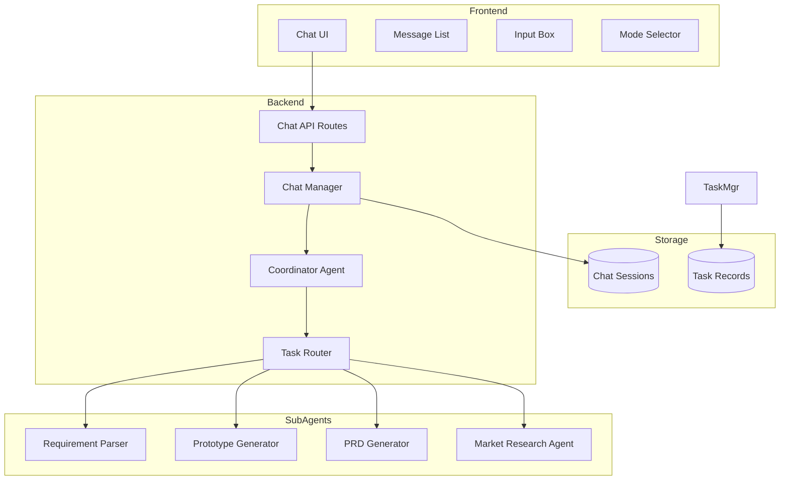

# Chat Agent Interaction - Technical Design

Feature Name: chat-agent-interaction
Updated: 2026-05-09

## Description

本功能为 PM Workstation 新增基于自然语言的会话交互界面，实现用户与主 Agent 的对话式任务交互。主 Agent 负责理解用户意图、任务规划和分发，子 Agent 执行具体任务并返回结果。

## Architecture



## Components and Interfaces

### 1. Frontend Components

#### ChatPage (`frontend/src/app/chat/page.tsx`)

主会话页面组件，包含会话列表、消息展示和输入区域。

```typescript
interface ChatSession {
  id: string;
  title: string;
  created_at: string;
  updated_at: string;
  message_count: number;
}

interface ChatMessage {
  id: string;
  role: 'user' | 'assistant' | 'system';
  content: string;
  task_mode?: TaskMode;
  task_status?: TaskStatus;
  task_result?: TaskResult;
  created_at: string;
}

type TaskMode = 'requirement' | 'prototype' | 'prd' | 'market_research';
type TaskStatus = 'pending' | 'running' | 'completed' | 'failed';
```

#### ChatSidebar (`frontend/src/components/chat/ChatSidebar.tsx`)

会话列表侧边栏，显示历史会话和新建按钮。

#### MessageList (`frontend/src/components/chat/MessageList.tsx`)

消息列表组件，展示对话内容，支持多种消息类型渲染。

#### ChatInput (`frontend/src/components/chat/ChatInput.tsx`)

输入组件，支持文本输入、快捷短语和模式选择。

#### TaskModeSelector (`frontend/src/components/chat/TaskModeSelector.tsx`)

任务模式选择器，显示可用模式并允许用户切换。

### 2. Backend Components

#### Chat API Routes (`src/pm_workstation/api/routes/chat.py`)

```python
# API Endpoints
POST   /api/v1/chat/sessions              # 创建新会话
GET    /api/v1/chat/sessions              # 获取会话列表
GET    /api/v1/chat/sessions/{id}         # 获取会话详情
DELETE /api/v1/chat/sessions/{id}         # 删除会话

POST   /api/v1/chat/sessions/{id}/messages  # 发送消息
GET    /api/v1/chat/sessions/{id}/messages  # 获取消息历史

POST   /api/v1/chat/sessions/{id}/task     # 创建任务
GET    /api/v1/chat/sessions/{id}/task/{task_id}/status  # 获取任务状态
```

#### Chat Manager (`src/pm_workstation/chat/chat_manager.py`)

管理会话生命周期和消息存储。

```python
class ChatManager:
    async def create_session(self, user_id: str) -> ChatSession
    async def get_session(self, session_id: str) -> ChatSession
    async def list_sessions(self, user_id: str) -> list[ChatSession]
    async def delete_session(self, session_id: str) -> bool
    
    async def add_message(self, session_id: str, message: ChatMessage) -> ChatMessage
    async def get_messages(self, session_id: str) -> list[ChatMessage]
```

#### Coordinator Agent (`src/pm_workstation/agents/coordinator_chat.py`)

主 Agent，负责理解用户意图和任务分发。

```python
class CoordinatorChatAgent:
    def __init__(self, llm_handler, task_router: TaskRouter):
        self.llm_handler = llm_handler
        self.task_router = task_router
    
    async def process_message(
        self, 
        message: str, 
        context: list[ChatMessage],
        selected_skills: list[str]
    ) -> CoordinatorResponse
    
    async def analyze_intent(self, message: str) -> IntentAnalysis
    async def plan_tasks(self, intent: IntentAnalysis) -> list[TaskPlan]
    async def format_result(self, result: TaskResult) -> str
```

#### Task Router (`src/pm_workstation/chat/task_router.py`)

任务路由器，根据任务类型分发给对应的子 Agent。

```python
class TaskRouter:
    def __init__(self):
        self.agents: dict[TaskMode, BaseAgent] = {}
    
    def register_agent(self, mode: TaskMode, agent: BaseAgent)
    async def execute_task(self, mode: TaskMode, params: dict) -> TaskResult
```

### 3. Data Models

#### ChatSession

```python
class ChatSession(BaseModel):
    id: str = Field(default_factory=lambda: str(uuid.uuid4()))
    user_id: str
    title: str
    created_at: datetime = Field(default_factory=datetime.now)
    updated_at: datetime = Field(default_factory=datetime.now)
    metadata: dict = {}
```

#### ChatMessage

```python
class ChatMessage(BaseModel):
    id: str = Field(default_factory=lambda: str(uuid.uuid4()))
    session_id: str
    role: Literal['user', 'assistant', 'system']
    content: str
    task_mode: Optional[TaskMode] = None
    task_id: Optional[str] = None
    task_status: Optional[TaskStatus] = None
    task_result: Optional[dict] = None
    created_at: datetime = Field(default_factory=datetime.now)
```

#### TaskResult

```python
class TaskResult(BaseModel):
    task_id: str
    task_mode: TaskMode
    status: TaskStatus
    output: Optional[str] = None
    artifacts: list[Artifact] = []
    error_message: Optional[str] = None
    started_at: Optional[datetime] = None
    completed_at: Optional[datetime] = None

class Artifact(BaseModel):
    type: Literal['document', 'prototype', 'report']
    name: str
    url: str
    preview_url: Optional[str] = None
```

## Correctness Properties

1. **会话隔离**: 每个会话的消息和任务相互独立，不可跨会话访问
2. **任务幂等**: 相同输入的重复任务应产生一致的结果
3. **状态一致性**: 任务状态必须与实际执行状态保持同步
4. **上下文完整性**: 消息历史必须完整保留，支持上下文理解

## Error Handling

1. **LLM 调用失败**: 返回友好错误提示，建议用户重试或简化需求
2. **子 Agent 超时**: 设置 300 秒超时，超时后标记任务失败并通知用户
3. **并发请求限制**: 每个会话同时只允许一个任务执行，新请求排队等待
4. **存储失败**: 使用内存缓存作为降级方案，提示用户数据可能丢失

## Test Strategy

1. **单元测试**: 测试各个 Agent 的核心逻辑和数据模型
2. **集成测试**: 测试任务路由和分发流程
3. **端到端测试**: 测试完整的用户交互流程
4. **性能测试**: 测试并发会话和消息处理能力

## Implementation Plan

### Phase 1: 基础会话功能
- 创建数据模型和数据库表
- 实现 Chat Manager 和 API Routes
- 开发前端会话界面

### Phase 2: 主 Agent 集成
- 实现 Coordinator Chat Agent
- 集成 LLM 进行意图识别
- 实现任务规划逻辑

### Phase 3: 子 Agent 任务分发
- 实现 Task Router
- 集成现有子 Agent
- 实现任务状态管理

### Phase 4: 结果展示优化
- 实现多种结果类型的渲染
- 添加 Markdown 预览支持
- 优化用户体验
