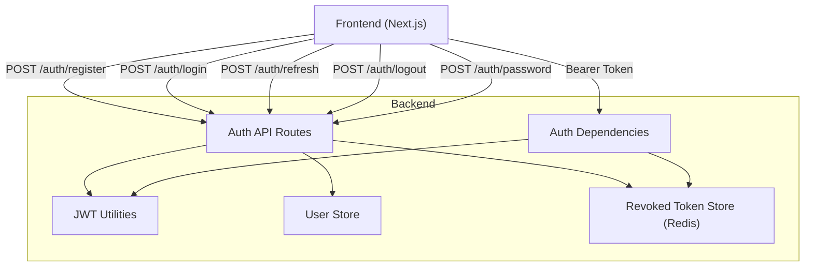
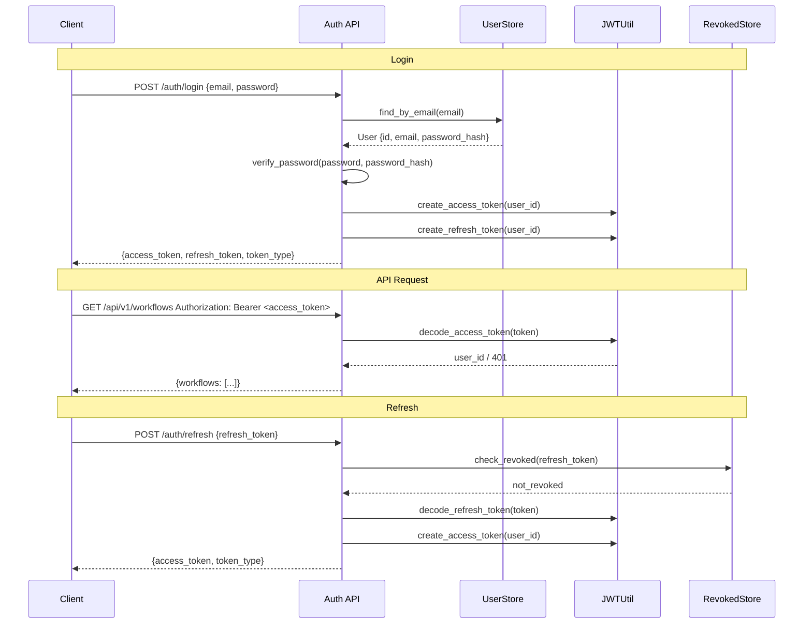

# JWT 认证系统

Feature Name: jwt-authentication
Updated: 2026-05-05

## Description

为产品经理多Agent协作工作站添加完整的 JWT 认证系统，包括用户注册、登录、Token 签发与验证、Token 刷新、登出和密码修改功能。替换当前的 `X-User-ID` 请求头临时认证方案，实现安全的用户身份管理和 API 访问控制。

## Architecture



### 认证流程



## Components and Interfaces

### 1. JWT Utilities (`src/pm_workstation/auth/jwt.py`)

Token 签发和验证的核心工具模块。

```python
# 核心函数
def create_access_token(user_id: str) -> str
def create_refresh_token(user_id: str) -> str
def decode_token(token: str, secret: str) -> dict
def verify_access_token(token: str) -> dict
def verify_refresh_token(token: str) -> dict
```

### 2. 用户模型 (`src/pm_workstation/auth/models.py`)

用户和 Token 相关的 Pydantic 模型。

```python
class User(Base)           # SQLAlchemy 用户表模型
class UserCreate           # 注册请求模型
class UserResponse         # 用户响应模型
class TokenPair            # Token 响应模型
class TokenRefresh         # 刷新请求模型
class PasswordChange       # 密码修改请求模型
```

### 3. 用户存储 (`src/pm_workstation/auth/user_store.py`)

用户数据持久化，使用 SQLAlchemy 连接配置文件中定义的 `database_url`。

```python
class UserStore:
    async def create_user(self, email: str, password: str) -> User
    async def find_by_email(self, email: str) -> User | None
    async def find_by_id(self, user_id: str) -> User | None
    async def update_password(self, user_id: str, new_password: str) -> bool
```

### 4. Token 撤销存储 (`src/pm_workstation/auth/token_store.py`)

使用 Redis 存储已撤销的 Refresh Token。

```python
class TokenStore:
    async def revoke_token(self, jti: str, expires_at: int)
    async def is_revoked(self, jti: str) -> bool
```

### 5. Auth 依赖 (`src/pm_workstation/auth/dependencies.py`)

FastAPI 依赖注入，替换现有的 `get_current_user`。

```python
async def get_current_user(token: str = Depends(oauth2_scheme)) -> str
async def get_current_user_optional(token: Optional[str]) -> Optional[str]
```

### 6. Auth 路由 (`src/pm_workstation/api/routes/auth.py`)

认证相关的 REST API 端点。

| Method | Path | Description |
|--------|------|-------------|
| POST | `/api/v1/auth/register` | 用户注册 |
| POST | `/api/v1/auth/login` | 用户登录 |
| POST | `/api/v1/auth/refresh` | Token 刷新 |
| POST | `/api/v1/auth/logout` | 用户登出 |
| POST | `/api/v1/auth/password` | 密码修改 |

### 7. 前端 Auth 模块 (`frontend/src/lib/auth.ts`)

前端 Token 管理和 API 拦截器。

```typescript
// 核心函数
function setTokens(access: string, refresh: string)
function getAccessToken(): string | null
function getRefreshToken(): string | null
function clearTokens()
function isTokenExpired(token: string): boolean
```

### 8. 前端登录页面 (`frontend/src/app/auth/login/page.tsx`)

用户登录/注册界面。

## Data Models

### 用户表 (users)

| 字段 | 类型 | 说明 |
|------|------|------|
| id | UUID (PK) | 用户唯一标识 |
| email | VARCHAR(255) UNIQUE | 邮箱地址 |
| password_hash | VARCHAR(255) | bcrypt 哈希密码 |
| is_active | BOOLEAN | 账户是否激活 |
| created_at | TIMESTAMP | 创建时间 |
| updated_at | TIMESTAMP | 更新时间 |

### JWT Token 结构

```json
// Access Token Payload
{
  "sub": "user-uuid",
  "type": "access",
  "exp": 1714905600,
  "iat": 1714904700
}

// Refresh Token Payload
{
  "sub": "user-uuid",
  "type": "refresh",
  "jti": "unique-token-id",
  "exp": 1715509500,
  "iat": 1714904700
}
```

### API 响应格式

```json
// POST /auth/login 响应
{
  "access_token": "eyJ...",
  "refresh_token": "eyJ...",
  "token_type": "bearer",
  "expires_in": 900
}

// POST /auth/refresh 响应
{
  "access_token": "eyJ...",
  "token_type": "bearer",
  "expires_in": 900
}
```

## Correctness Properties

1. **密码永不以明文存储**：所有密码在入库前必须经过 bcrypt 哈希。
2. **Access Token 不可撤销**：Access Token 有效期短（15分钟），依赖过期机制实现失效。
3. **Refresh Token 可撤销**：登出时 Refresh Token 的 JTI 写入 Redis 黑名单。
4. **Token 绑定用户**：每个 Token 的 `sub` 字段必须对应数据库中存在的有效用户。
5. **请求必须携带有效 Token**：除 `/auth/register`、`/auth/login`、`/auth/refresh`、`/health` 外，所有 API 端点必须验证 Bearer Token。

## Error Handling

| 场景 | HTTP 状态码 | 错误信息 |
|------|------------|---------|
| 邮箱已注册 | 400 | "邮箱已被注册" |
| 密码格式无效 | 400 | "密码长度不得少于8个字符" |
| 邮箱格式无效 | 400 | "邮箱格式无效" |
| 登录失败 | 401 | "邮箱或密码错误" |
| Token 缺失 | 401 | "未提供认证令牌" |
| Token 过期 | 401 | "认证令牌已过期" |
| Token 无效 | 401 | "无效的认证令牌" |
| 旧密码错误 | 401 | "旧密码不正确" |
| 登出后使用旧 Token | 401 | "认证令牌已失效" |

## Test Strategy

### 单元测试

| 模块 | 测试用例 |
|------|---------|
| JWT Utilities | Token 签发、解码、过期验证、签名验证 |
| User Store | 创建用户、查找用户、密码更新 |
| Token Store | Token 撤销、黑名单检查 |
| Auth Dependencies | 有效 Token、无效 Token、缺失 Token |
| Auth Routes | 注册、登录、刷新、登出、密码修改 |

### 集成测试

1. 完整注册 -> 登录 -> API 访问 -> 刷新 Token -> 登出 -> Token 失效 流程
2. 并发请求下 Token 验证的性能测试
3. 密码修改后旧 Token 失效验证

### 安全测试

1. 暴力破解防护（可选：添加速率限制）
2. Token 篡改检测
3. 重放攻击防护（JTI 黑名单）

## 依赖新增

- `python-jose[cryptography]>=3.3.0` - JWT 签发和验证
- `passlib[bcrypt]>=1.7.4` - 密码哈希
- `SQLAlchemy[asyncio]>=2.0.0` - 异步数据库操作（已有 SQLAlchemy，需确认异步支持）
- `aiosqlite` 或 `asyncpg` - 异步数据库驱动

## References

[^1]: (Filename) - [pydantic-settings config](src/pm_workstation/config.py)
[^2]: (Filename) - [API dependencies](src/pm_workstation/api/dependencies.py)
[^3]: (Filename) - [FastAPI app](src/pm_workstation/api/app.py)
[^4]: (Filename) - [Frontend API client](frontend/src/lib/api.ts)
