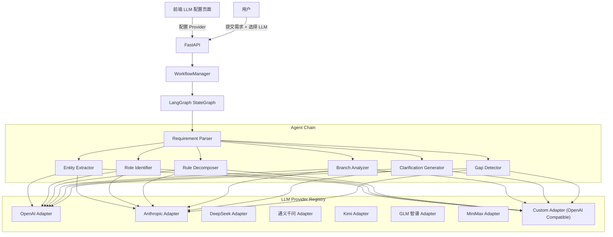

# LLM 多供应商接入与完整工作流验证

Feature Name: llm-integration-test
Updated: 2026-05-05

## Description

为产品经理多Agent协作工作站接入多个真实 LLM 服务（OpenAI、Anthropic Claude、DeepSeek、通义千问、Kimi、GLM、MiniMax 等），支持通过前端界面配置和管理 API Key，验证完整的 AI 驱动工作流。

## Architecture



## 支持的 LLM 提供商

| 提供商 | 适配器类型 | 说明 |
|--------|-----------|------|
| OpenAI | `OpenAIAdapter` | 使用 openai.AsyncOpenAI，支持 GPT-4o/GPT-4o-mini |
| Anthropic | `AnthropicAdapter` | 使用 anthropic.AsyncAnthropic，支持 Claude 3.5 Sonnet |
| DeepSeek | `CustomAdapter` | OpenAI 兼容格式，base_url: https://api.deepseek.com/v1 |
| 通义千问 | `CustomAdapter` | OpenAI 兼容格式，base_url: https://dashscope.aliyuncs.com/compatible-mode/v1 |
| Kimi | `CustomAdapter` | OpenAI 兼容格式，base_url: https://api.moonshot.cn/v1 |
| GLM 智谱 | `CustomAdapter` | OpenAI 兼容格式，base_url: https://open.bigmodel.cn/api/paas/v4 |
| MiniMax | `CustomAdapter` | OpenAI 兼容格式，base_url: https://api.minimax.chat/v1 |
| 自定义 | `CustomAdapter` | 任意 OpenAI 兼容格式的 API |

## Components and Interfaces

### 1. LLM Provider 配置模型 (`src/pm_workstation/llm/models.py`)

```python
class LLMProviderType(str, Enum):
    OPENAI = "openai"
    ANTHROPIC = "anthropic"
    CUSTOM = "custom"

class LLMProviderConfig(BaseModel):
    id: str
    name: str
    provider_type: LLMProviderType
    api_key: str
    base_url: Optional[str]  # 自定义供应商必填
    default_model: str
    is_active: bool = True
    is_default: bool = False
```

### 2. LLM 配置存储 (`src/pm_workstation/llm/provider_store.py`)

```python
class LLMProviderStore:
    async def create_config(config: LLMProviderConfig) -> LLMProviderConfig
    async def get_config(config_id: str) -> Optional[LLMProviderConfig]
    async def list_configs() -> List[LLMProviderConfig]
    async def update_config(config_id: str, updates: dict) -> LLMProviderConfig
    async def delete_config(config_id: str) -> bool
    async def get_default_config() -> Optional[LLMProviderConfig]
    async def set_default(config_id: str) -> bool
```

### 3. LLM 工厂 (`src/pm_workstation/llm/factory.py`)

```python
class LLMFactory:
    @staticmethod
    def create_adapter(config: LLMProviderConfig) -> LLMBackend
```

### 4. LLM API 路由 (`src/pm_workstation/api/routes/llm.py`)

| Method | Path | Description |
|--------|------|-------------|
| GET | `/api/v1/llm/providers` | 列出所有 LLM 配置 |
| POST | `/api/v1/llm/providers` | 创建 LLM 配置 |
| PUT | `/api/v1/llm/providers/{id}` | 更新 LLM 配置 |
| DELETE | `/api/v1/llm/providers/{id}` | 删除 LLM 配置 |
| POST | `/api/v1/llm/providers/{id}/test` | 测试 LLM 连通性 |
| POST | `/api/v1/llm/providers/{id}/set-default` | 设置为默认 Provider |

### 5. 工作流集成

修改 `WorkflowManager.start_workflow()` 接受 `llm_provider_id` 参数。

### 6. 前端 LLM 配置页面

`frontend/src/app/settings/llm/page.tsx`

## Data Models

### LLM Provider 配置表 (llm_providers)

| 字段 | 类型 | 说明 |
|------|------|------|
| id | VARCHAR(36) PK | 配置唯一标识 |
| name | VARCHAR(100) | 显示名称 |
| provider_type | VARCHAR(20) | openai/anthropic/custom |
| api_key | VARCHAR(500) | API Key |
| base_url | VARCHAR(500) | API Base URL |
| default_model | VARCHAR(100) | 默认模型名称 |
| is_active | BOOLEAN | 是否启用 |
| is_default | BOOLEAN | 是否为默认 Provider |

## Correctness Properties

1. **API Key 加密存储**：API Key 不得以明文存储在数据库或日志中
2. **连通性测试超时**：测试请求必须在 30 秒内完成
3. **默认 Provider 唯一**：同一时间只能有一个默认 Provider
4. **LLM 调用可重试**：网络错误时必须使用 FallbackHandler 重试

## Error Handling

| 场景 | HTTP 状态码 | 错误信息 |
|------|------------|---------|
| API Key 无效 | 400 | "API Key 无效，请检查后重试" |
| 网络超时 | 408 | "LLM 服务响应超时" |
| 配额耗尽 | 429 | "LLM 配额已耗尽" |
| Provider 不存在 | 404 | "LLM Provider 不存在" |
| 连通性测试失败 | 502 | "无法连接到 LLM 服务" |

## Test Strategy

### 单元测试
- LLM 工厂创建适配器
- Provider 存储 CRUD 操作
- 连通性测试逻辑

### 集成测试
- OpenAI 连通性测试
- Anthropic 连通性测试
- 自定义供应商连通性测试

### E2E 测试
- 完整工作流使用真实 LLM
- Provider 切换验证
- 降级和错误处理验证

## References

[^1]: (Filename) - [model_router/base.py](src/pm_workstation/model_router/base.py)
[^2]: (Filename) - [model_router/openai_adapter.py](src/pm_workstation/model_router/openai_adapter.py)
[^3]: (Filename) - [model_router/anthropic_adapter.py](src/pm_workstation/model_router/anthropic_adapter.py)
[^4]: (Filename) - [orchestrator/workflow_manager.py](src/pm_workstation/orchestrator/workflow_manager.py)
