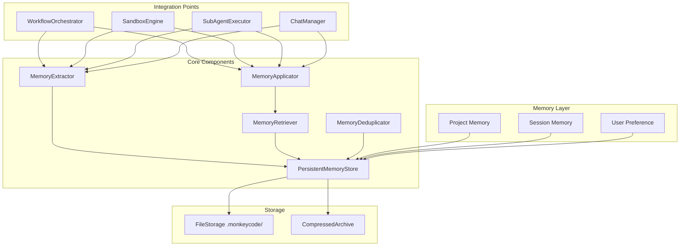
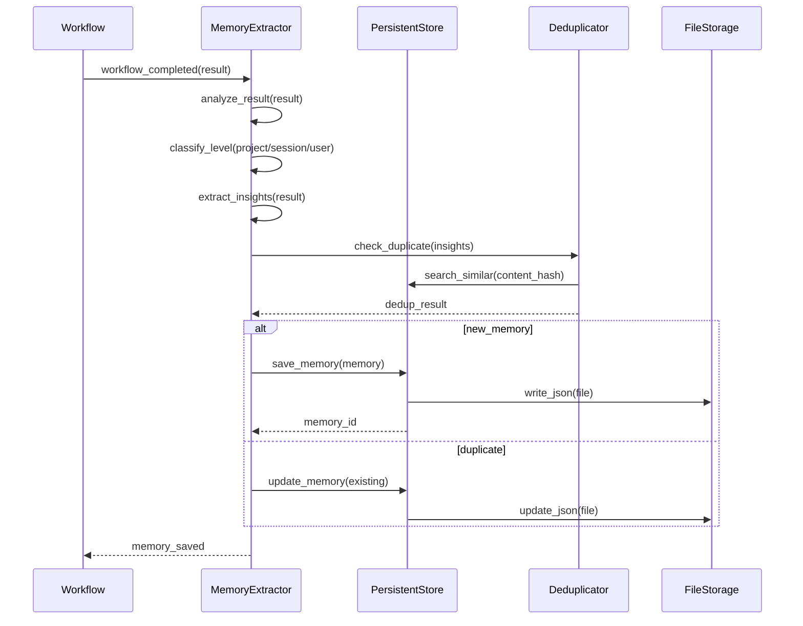
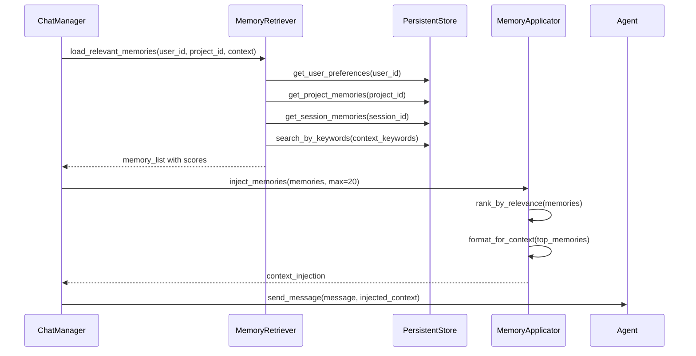

# 记忆持久化系统技术设计

Feature Name: memory-persistence-system
Updated: 2026-05-21

## Description

记忆持久化系统提供多层级记忆管理，包括项目级记忆、会话级记忆、长期偏好记忆的自动提取、存储、检索和应用。解决现有 MemoryManager 仅内存存储的问题。

## Architecture

### 整体架构



### 记忆提取流程



### 记忆应用流程



## Components and Interfaces

### 1. MemoryLevel (枚举)

```python
class MemoryLevel(str, Enum):
    """记忆层级"""
    PROJECT = "project_level"      # 项目级记忆
    SESSION = "session_level"       # 会话级记忆
    USER = "user_level"            # 用户级偏好
    
    ARCHIVED = "archived"          # 已归档
```

### 2. PersistentMemoryEntry

```python
class PersistentMemoryEntry(BaseModel):
    """持久化记忆条目"""
    id: str
    user_id: str
    project_id: Optional[str] = None
    session_id: Optional[str] = None
    level: MemoryLevel
    memory_type: MemoryType
    
    content: str                    # 记忆内容
    summary: str                    # 摘要
    keywords: list[str]             # 关键词
    
    importance: float = 0.5         # 重要性 0-1
    confidence: float = 0.8         # 置信度 0-1
    
    source_type: str                # workflow, sandbox, chat, feedback
    source_id: str                  # workflow_id, execution_id, message_id
    
    context: dict                   # 上下文信息
    
    created_at: datetime
    updated_at: datetime
    last_accessed: datetime
    access_count: int = 0
    
    content_hash: str               # 内容哈希（用于去重）
    similarity_threshold: float = 0.8
```

### 3. PersistentMemoryStore

```python
class PersistentMemoryStore:
    """持久化记忆存储"""
    
    def __init__(
        self,
        base_path: str = ".monkeycode",
        cache_size: int = 1000,
    ):
        self.base_path = base_path
        self._cache: dict[str, PersistentMemoryEntry] = {}
        self._indexes: dict[str, list[str]] = {}
    
    async def initialize(self) -> None:
        """初始化，加载所有记忆到缓存"""
        
    async def save(
        self,
        memory: PersistentMemoryEntry,
    ) -> PersistentMemoryEntry:
        """保存记忆到文件系统"""
        
    async def update(
        self,
        memory_id: str,
        updates: dict,
    ) -> Optional[PersistentMemoryEntry]:
        """更新记忆"""
        
    async def delete(
        self,
        memory_id: str,
    ) -> bool:
        """删除记忆"""
        
    async def get(
        self,
        memory_id: str,
    ) -> Optional[PersistentMemoryEntry]:
        """获取单个记忆"""
        
    async def list_by_level(
        self,
        level: MemoryLevel,
        user_id: str,
        project_id: Optional[str] = None,
        session_id: Optional[str] = None,
        limit: int = 100,
    ) -> list[PersistentMemoryEntry]:
        """按层级列出记忆"""
        
    async def search(
        self,
        query: str,
        user_id: str,
        project_id: Optional[str] = None,
        limit: int = 20,
    ) -> list[MemorySearchResult]:
        """搜索记忆"""
        
    async def search_similar(
        self,
        content_hash: str,
        threshold: float = 0.8,
    ) -> list[PersistentMemoryEntry]:
        """搜索相似记忆"""
        
    async def archive_old(
        self,
        max_age_days: int = 30,
        min_access_count: int = 1,
    ) -> int:
        """归档旧记忆"""
        
    async def load_all(self) -> None:
        """加载所有记忆到缓存"""
        
    async def rebuild_indexes(self) -> None:
        """重建索引"""
```

### 4. MemoryExtractor

```python
class MemoryExtractor:
    """记忆提取器"""
    
    def __init__(
        self,
        store: PersistentMemoryStore,
    ):
        self.store = store
    
    async def extract_from_workflow(
        self,
        workflow_result: WorkflowExecution,
        user_id: str,
        project_id: Optional[str] = None,
    ) -> list[PersistentMemoryEntry]:
        """从 Workflow 执行结果提取记忆"""
        
    async def extract_from_sandbox(
        self,
        sandbox_summary: ExecutionSummary,
        user_id: str,
        session_id: str,
    ) -> list[PersistentMemoryEntry]:
        """从 Sandbox 执行结果提取记忆"""
        
    async def extract_from_chat(
        self,
        message: ChatMessage,
        response: ChatResponse,
        user_id: str,
        session_id: str,
    ) -> list[PersistentMemoryEntry]:
        """从对话提取记忆"""
        
    async def extract_from_feedback(
        self,
        feedback: UserFeedback,
        user_id: str,
    ) -> PersistentMemoryEntry:
        """从用户反馈提取记忆"""
        
    async def extract_from_user_input(
        self,
        user_input: str,
        context: dict,
        user_id: str,
    ) -> Optional[PersistentMemoryEntry]:
        """从用户输入提取偏好记忆"""
    
    def _classify_level(
        self,
        source_type: str,
        context: dict,
    ) -> MemoryLevel:
        """分类记忆层级"""
        
    def _extract_keywords(
        self,
        content: str,
    ) -> list[str]:
        """提取关键词"""
        
    def _compute_hash(
        self,
        content: str,
    ) -> str:
        """计算内容哈希"""
        
    def _compute_importance(
        self,
        source_type: str,
        context: dict,
    ) -> float:
        """计算重要性"""
        
    def _summarize(
        self,
        content: str,
        max_length: int = 100,
    ) -> str:
        """生成摘要"""
```

### 5. MemoryRetriever

```python
class MemoryRetriever:
    """记忆检索器"""
    
    def __init__(
        self,
        store: PersistentMemoryStore,
    ):
        self.store = store
    
    async def retrieve_for_session(
        self,
        user_id: str,
        project_id: Optional[str] = None,
        session_id: str,
        context_keywords: list[str],
        max_memories: int = 20,
    ) -> list[MemorySearchResult]:
        """为会话检索相关记忆"""
        
    async def retrieve_user_preferences(
        self,
        user_id: str,
        category: Optional[str] = None,
    ) -> list[PersistentMemoryEntry]:
        """检索用户偏好"""
        
    async def retrieve_project_memories(
        self,
        project_id: str,
        tags: Optional[list[str]] = None,
        limit: int = 50,
    ) -> list[PersistentMemoryEntry]:
        """检索项目记忆"""
        
    async def retrieve_session_memories(
        self,
        session_id: str,
    ) -> list[PersistentMemoryEntry]:
        """检索会话记忆"""
        
    async def search_by_keywords(
        self,
        keywords: list[str],
        user_id: str,
        project_id: Optional[str] = None,
        limit: int = 20,
    ) -> list[MemorySearchResult]:
        """关键词搜索"""
        
    def _compute_relevance(
        self,
        memory: PersistentMemoryEntry,
        keywords: list[str],
    ) -> float:
        """计算相关性"""
        
    def _rank_memories(
        self,
        memories: list[MemorySearchResult],
        by_importance: bool = True,
        by_access: bool = True,
    ) -> list[MemorySearchResult]:
        """排序记忆"""
```

### 6. MemoryApplicator

```python
class MemoryApplicator:
    """记忆应用器"""
    
    def __init__(
        self,
        retriever: MemoryRetriever,
    ):
        self.retriever = retriever
    
    async def inject_to_context(
        self,
        context: AgentContext,
        memories: list[MemorySearchResult],
        max_tokens: int = 2000,
    ) -> AgentContext:
        """将记忆注入到 Agent 上下文"""
        
    async def format_for_prompt(
        self,
        memories: list[MemorySearchResult],
        format_type: str = "markdown",
    ) -> str:
        """格式化记忆为提示词"""
        
    async def apply_preferences(
        self,
        preferences: list[PersistentMemoryEntry],
        output_config: dict,
    ) -> dict:
        """应用偏好到输出配置"""
        
    def _estimate_tokens(
        self,
        text: str,
    ) -> int:
        """估算 Token 数量"""
        
    def _truncate_memories(
        self,
        memories: list[MemorySearchResult],
        max_tokens: int,
    ) -> list[MemorySearchResult]:
        """截断记忆列表以符合 Token 限制"""
```

### 7. MemoryDeduplicator

```python
class MemoryDeduplicator:
    """记忆去重器"""
    
    def __init__(
        self,
        store: PersistentMemoryStore,
        similarity_threshold: float = 0.8,
    ):
        self.store = store
        self.similarity_threshold = similarity_threshold
    
    async def check_duplicate(
        self,
        content: str,
        user_id: str,
        level: MemoryLevel,
    ) -> Optional[PersistentMemoryEntry]:
        """检查是否有重复记忆"""
        
    async def merge_memories(
        self,
        existing: PersistentMemoryEntry,
        new: PersistentMemoryEntry,
    ) -> PersistentMemoryEntry:
        """合并重复记忆"""
        
    def _compute_similarity(
        self,
        content1: str,
        content2: str,
    ) -> float:
        """计算内容相似度"""
        
    def _keep_better(
        self,
        existing: PersistentMemoryEntry,
        new: PersistentMemoryEntry,
    ) -> PersistentMemoryEntry:
        """保留更好的记忆"""
```

## Data Models

### UserPreference

```python
class UserPreference(BaseModel):
    """用户偏好"""
    id: str
    user_id: str
    category: PreferenceCategory    # language, format, style, workflow, tool
    key: str                        # preference key
    value: str                      # preference value
    confidence: float               # confidence level
    learned_from: list[str]         # sources that taught this preference
    created_at: datetime
    updated_at: datetime
```

### PreferenceCategory

```python
class PreferenceCategory(str, Enum):
    """偏好类别"""
    LANGUAGE = "language"           # 语言偏好
    OUTPUT_FORMAT = "format"        # 输出格式
    COMMUNICATION_STYLE = "style"   # 沟通风格
    WORKFLOW = "workflow"           # 工作流程
    TOOL_USAGE = "tool"             # 工具使用
    RESPONSE_LENGTH = "length"      # 回复长度
    DETAIL_LEVEL = "detail"         # 详细程度
```

### ProjectMemory

```python
class ProjectMemory(BaseModel):
    """项目记忆"""
    id: str
    project_id: str
    user_id: str
    
    memory_type: ProjectMemoryType  # constraint, decision, pattern, artifact
    
    title: str                      # 记忆标题
    content: str                    # 记忆内容
    impact: str                     # 影响说明
    
    related_files: list[str]        # 相关文件
    related_artifacts: list[str]    # 相关产物
    
    created_at: datetime
    updated_at: datetime
```

### ProjectMemoryType

```python
class ProjectMemoryType(str, Enum):
    """项目记忆类型"""
    CONSTRAINT = "constraint"       # 项目约束
    DECISION = "decision"           # 技术决策
    PATTERN = "pattern"             # 代码模式
    ARTIFACT_REFERENCE = "artifact" # 产物引用
    ERROR_LESSON = "error_lesson"   # 错误教训
    OPTIMIZATION = "optimization"   # 优化记录
```

### SessionMemory

```python
class SessionMemory(BaseModel):
    """会话记忆"""
    id: str
    session_id: str
    user_id: str
    
    memory_type: SessionMemoryType  # context, entity, task, error
    
    content: str
    entities: list[str]             # 提取的实体
    files_mentioned: list[str]      # 提到的文件
    
    importance: float
    
    created_at: datetime
```

### SessionMemoryType

```python
class SessionMemoryType(str, Enum):
    """会话记忆类型"""
    CONTEXT = "context"             # 上下文信息
    ENTITY = "entity"               # 实体记录
    TASK_STATE = "task"             # 任务状态
    ERROR_CONTEXT = "error"         # 错误上下文
    FILE_REFERENCE = "file"         # 文件引用
    USER_CORRECTION = "correction"  # 用户纠正
```

## Storage Structure

### 目录结构

```
.monkeycode/
├── users/
│   └── {user_id}/
│       ├── preferences/
│       │   ├── language.json
│       │   ├── format.json
│       │   ├── workflow.json
│       │   └── preferences_index.json
│       └── stats.json
│
├── projects/
│   └── {project_id}/
│       ├── memory/
│       │   ├── constraints.json
│       │   ├── decisions.json
│       │   ├── patterns.json
│       │   ├── artifacts.json
│       │   └── memory_index.json
│       └── context.json
│
├── sessions/
│   └── {session_id}/
│       ├── memory/
│       │   ├── context.json
│       │   ├── entities.json
│       │   ├── tasks.json
│       │   ├── errors.json
│       │   └── session_index.json
│       └── summary.json
│
├── archived/
│   ├── {year_month}/
│   │   ├── users_{user_id}.json.gz
│   │   ├── projects_{project_id}.json.gz
│   │   └── sessions_{session_id}.json.gz
│   └── archive_index.json
│
└── global/
    ├── memory_stats.json
    ├── indexes.json
    └── config.json
```

### JSON 格式示例

#### 用户偏好文件

```json
{
  "user_id": "user_abc123",
  "preferences": [
    {
      "id": "pref_001",
      "category": "language",
      "key": "output_language",
      "value": "zh-CN",
      "confidence": 0.95,
      "learned_from": ["explicit", "session_001", "session_002"],
      "created_at": "2026-05-21T10:00:00",
      "updated_at": "2026-05-21T15:00:00"
    }
  ],
  "version": 1,
  "last_updated": "2026-05-21T15:00:00"
}
```

#### 项目记忆文件

```json
{
  "project_id": "proj_xyz",
  "memories": [
    {
      "id": "mem_001",
      "memory_type": "decision",
      "title": "使用 FastAPI 作为后端框架",
      "content": "项目选择 FastAPI 作为后端框架，原因是性能好、异步支持、自动文档",
      "impact": "所有后端 API 开发使用 FastAPI",
      "related_files": ["src/pm_workstation/api/app.py"],
      "created_at": "2026-05-20T10:00:00"
    }
  ],
  "version": 1
}
```

#### 会话记忆文件

```json
{
  "session_id": "sess_abc",
  "memories": [
    {
      "id": "sess_mem_001",
      "memory_type": "entity",
      "content": "用户正在设计登录页面原型",
      "entities": ["登录页面", "原型", "用户认证"],
      "files_mentioned": [],
      "importance": 0.7,
      "created_at": "2026-05-21T10:05:00"
    }
  ],
  "version": 1
}
```

## Integration Points

### 1. WorkflowOrchestrator Integration

```python
class WorkflowOrchestrator:
    def __init__(self, ...):
        self.memory_extractor = MemoryExtractor(store)
        self.memory_retriever = MemoryRetriever(store)
    
    async def execute_workflow(self, workflow, ...):
        # 1. 检索相关项目记忆
        project_memories = await self.memory_retriever.retrieve_project_memories(
            project_id=context.project_id,
        )
        
        # 2. 注入记忆到上下文
        context = await self.memory_applicator.inject_to_context(
            context, project_memories
        )
        
        # 3. 执行工作流
        result = await self._execute_steps(workflow, context)
        
        # 4. 提取执行记忆
        memories = await self.memory_extractor.extract_from_workflow(
            result, user_id, project_id
        )
        
        # 5. 保存记忆
        for memory in memories:
            await self.store.save(memory)
        
        return result
```

### 2. SandboxEngine Integration

```python
class SandboxEngine:
    def __init__(self, ...):
        self.memory_extractor = MemoryExtractor(store)
    
    async def finalize_execution(self, context):
        summary = self._create_summary(context)
        
        # 提取 Sandbox 执行记忆
        memories = await self.memory_extractor.extract_from_sandbox(
            summary, user_id, session_id
        )
        
        for memory in memories:
            await self.store.save(memory)
        
        return summary
```

### 3. ChatManager Integration

```python
class ChatManager:
    def __init__(self, ...):
        self.memory_extractor = MemoryExtractor(store)
        self.memory_retriever = MemoryRetriever(store)
        self.memory_applicator = MemoryApplicator(retriever)
    
    async def process_message(self, message, session):
        # 1. 检索相关记忆
        memories = await self.memory_retriever.retrieve_for_session(
            user_id=session.user_id,
            project_id=session.project_id,
            session_id=session.id,
            context_keywords=self._extract_keywords(message),
        )
        
        # 2. 注入记忆到上下文
        injected_context = await self.memory_applicator.inject_to_context(
            context, memories
        )
        
        # 3. 生成回复
        response = await self.agent.generate(message, injected_context)
        
        # 4. 提取对话记忆
        new_memories = await self.memory_extractor.extract_from_chat(
            message, response, user_id, session_id
        )
        
        # 5. 保存记忆
        for memory in new_memories:
            await self.store.save(memory)
        
        return response
```

## Correctness Properties

### Invariants

1. **Atomicity**: Memory save operations SHALL be atomic (write temp then rename)
2. **Consistency**: Memory cache SHALL always reflect file state after load
3. **Durability**: Saved memories SHALL persist across application restart
4. **Uniqueness**: Duplicate memories SHALL be merged, not duplicated

### Constraints

1. **Token Limit**: Injected memories SHALL not exceed 2000 tokens
2. **Memory Limit**: Injected memory count SHALL not exceed 20 items
3. **Storage Limit**: User memory storage SHALL not exceed 100MB
4. **Age Limit**: Session memories older than 24h SHALL be archived unless important

## Error Handling

### Error Categories

| Error | Cause | Handling |
|-------|-------|----------|
| `memory_save_failed` | Disk write error | Retry 3 times, then log and skip |
| `memory_load_failed` | Corrupted JSON file | Log error, skip file, continue |
| `memory_corrupted` | Invalid memory data | Log and quarantine file |
| `memory_overflow` | Too many memories to inject | Truncate to limit |
| `duplicate_conflict` | Merge conflict | Keep higher importance |

## Test Strategy

### Unit Tests

1. **PersistentMemoryStore Tests**
   - Save/load/delete memory
   - Search by keywords
   - Deduplication check
   - Archive old memories

2. **MemoryExtractor Tests**
   - Extract from workflow result
   - Extract from sandbox execution
   - Extract from chat message
   - Classify memory level

3. **MemoryRetriever Tests**
   - Retrieve by level
   - Keyword search
   - Relevance ranking

### Integration Tests

1. **Workflow Integration**
   - Memory injection before execution
   - Memory extraction after execution

2. **Sandbox Integration**
   - Memory extraction from tool results

3. **Chat Integration**
   - Memory injection to context
   - Memory extraction from dialogue

### Persistence Tests

1. **Restart Recovery**
   - Stop application
   - Restart application
   - Verify memories loaded correctly

2. **Concurrent Access**
   - Multiple save operations
   - Verify atomicity

## API Design

```python
@router.post("/memory/persistent", summary="创建持久化记忆")
async def create_persistent_memory(...)

@router.get("/memory/persistent/{memory_id}", summary="获取记忆")
async def get_persistent_memory(...)

@router.get("/memory/persistent/by-level/{level}", summary="按层级获取记忆")
async def list_memories_by_level(...)

@router.get("/memory/persistent/search", summary="搜索记忆")
async def search_memories(...)

@router.get("/memory/preferences/{user_id}", summary="获取用户偏好")
async def get_user_preferences(...)

@router.put("/memory/preferences/{user_id}", summary="更新用户偏好")
async def update_user_preference(...)

@router.get("/memory/project/{project_id}", summary="获取项目记忆")
async def get_project_memories(...)

@router.post("/memory/extract", summary="手动提取记忆")
async def manual_extract_memory(...)

@router.get("/memory/stats", summary="获取记忆统计")
async def get_memory_stats(...)
```

## References

[^1]: (src/pm_workstation/memory/memory_manager.py) - 现有 MemoryManager
[^2]: (src/pm_workstation/memory/memory_models.py) - 现有 Memory 数据模型
[^3]: (src/pm_workstation/workflow/workflow_orchestrator.py) - Workflow 集成点
[^4]: (src/pm_workstation/sandbox/engine.py) - Sandbox 集成点
[^5]: (.monkeycode/MEMORY.md) - 项目级指令记忆示例