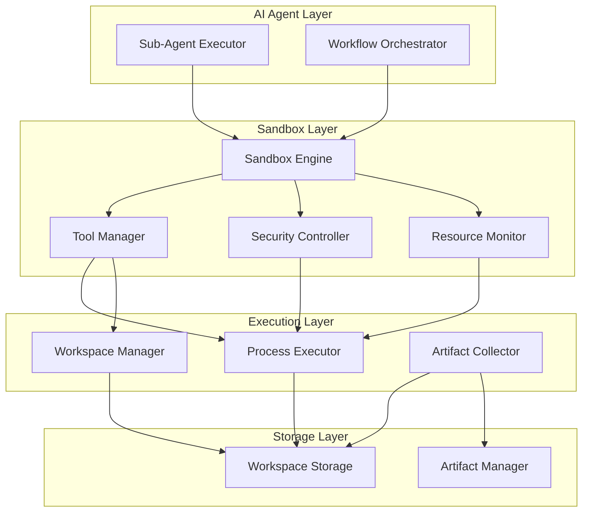
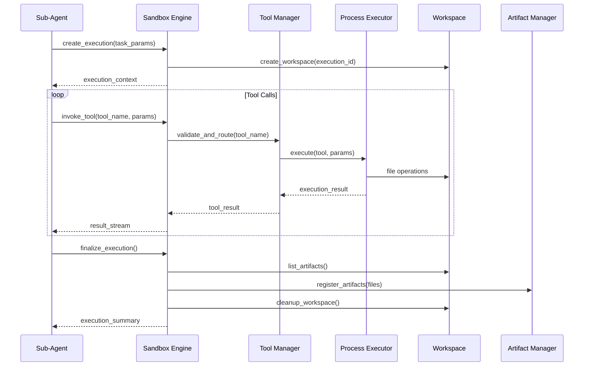

# Sandbox 执行环境技术设计

Feature Name: sandbox-execution-environment
Updated: 2026-05-21

## Description

Sandbox 执行环境为 AI Agent 提供安全隔离的代码运行环境，支持文件操作、Shell 执行、Python 代码执行等能力。这是 Sub-Agent 和 Workflow 执行的底层支撑，让 Agent 从"文本生成"进化为"真实执行"。

## Architecture

### 整体架构



### 执行流程



## Components and Interfaces

### 1. SandboxEngine

核心执行引擎，管理执行上下文、协调工具调用、收集产物。

```python
class SandboxEngine:
    """Sandbox 执行引擎"""
    
    def create_execution(
        self,
        execution_id: str,
        task_params: dict,
        timeout: int = 60,
        resource_limits: Optional[ResourceLimits] = None,
    ) -> ExecutionContext:
        """创建执行上下文"""
        
    async def invoke_tool(
        self,
        context: ExecutionContext,
        tool_name: str,
        params: dict,
    ) -> ToolResult:
        """调用工具"""
        
    async def execute_streaming(
        self,
        context: ExecutionContext,
        tool_calls: list[ToolCall],
    ) -> AsyncGenerator[ExecutionEvent, None]:
        """流式执行多个工具调用"""
        
    def finalize_execution(
        self,
        context: ExecutionContext,
    ) -> ExecutionSummary:
        """结束执行，收集产物"""
        
    def get_execution_status(
        self,
        execution_id: str,
    ) -> ExecutionStatus:
        """获取执行状态"""
```

### 2. ToolManager

工具管理器，注册、验证、执行工具。

```python
class ToolManager:
    """工具管理器"""
    
    def register_tool(self, tool: Tool) -> None:
        """注册工具"""
        
    def get_tool(self, name: str) -> Optional[Tool]:
        """获取工具定义"""
        
    def list_tools(self) -> list[ToolDefinition]:
        """列出所有可用工具"""
        
    def validate_params(
        self,
        tool: Tool,
        params: dict,
    ) -> ValidationResult:
        """验证工具参数"""
        
    async def execute_tool(
        self,
        tool: Tool,
        params: dict,
        context: ExecutionContext,
    ) -> ToolResult:
        """执行工具"""
```

### 3. ProcessExecutor

进程执行器，在安全隔离环境中执行命令和代码。

```python
class ProcessExecutor:
    """进程执行器"""
    
    async def execute_shell(
        self,
        command: str,
        context: ExecutionContext,
        timeout: int = 30,
    ) -> CommandResult:
        """执行 Shell 命令"""
        
    async def execute_python(
        self,
        code: str,
        context: ExecutionContext,
        timeout: int = 30,
        input_data: Optional[dict] = None,
    ) -> PythonResult:
        """执行 Python 代码"""
        
    async def execute_script(
        self,
        script_path: str,
        context: ExecutionContext,
        args: list[str] = [],
        timeout: int = 30,
    ) -> ScriptResult:
        """执行脚本文件"""
```

### 4. WorkspaceManager

工作区管理器，管理文件操作。

```python
class WorkspaceManager:
    """工作区管理器"""
    
    def create_workspace(
        self,
        execution_id: str,
        base_path: str = "/tmp/sandbox",
    ) -> Workspace:
        """创建工作区"""
        
    def read_file(
        self,
        workspace: Workspace,
        file_path: str,
    ) -> FileContent:
        """读取文件"""
        
    def write_file(
        self,
        workspace: Workspace,
        file_path: str,
        content: str,
        content_type: str = "text/plain",
    ) -> FileInfo:
        """写入文件"""
        
    def list_files(
        self,
        workspace: Workspace,
        directory: str = "",
    ) -> list[FileInfo]:
        """列出文件"""
        
    def delete_file(
        self,
        workspace: Workspace,
        file_path: str,
    ) -> bool:
        """删除文件"""
        
    def cleanup_workspace(
        self,
        workspace: Workspace,
    ) -> None:
        """清理工作区"""
```

### 5. SecurityController

安全控制器，验证命令和参数的安全性。

```python
class SecurityController:
    """安全控制器"""
    
    BLOCKED_COMMANDS = [
        "rm", "sudo", "chmod", "chown", "iptables",
        "shutdown", "reboot", "fdisk", "mkfs", "mount",
        "umount", "passwd", "useradd", "userdel",
    ]
    
    BLOCKED_HOSTS = [
        "localhost", "127.0.0.1", "0.0.0.0",
        "10.*", "172.16.*", "192.168.*",
    ]
    
    def validate_command(
        self,
        command: str,
    ) -> SecurityValidation:
        """验证 Shell 命令安全性"""
        
    def validate_file_path(
        self,
        path: str,
        workspace: Workspace,
    ) -> SecurityValidation:
        """验证文件路径安全性"""
        
    def validate_url(
        self,
        url: str,
    ) -> SecurityValidation:
        """验证 URL 安全性"""
        
    def check_resource_usage(
        self,
        context: ExecutionContext,
    ) -> ResourceStatus:
        """检查资源使用状态"""
```

### 6. ResourceMonitor

资源监控器，监控执行过程中的资源使用。

```python
class ResourceMonitor:
    """资源监控器"""
    
    DEFAULT_LIMITS = ResourceLimits(
        max_cpu_time=60,
        max_memory_mb=512,
        max_file_size_mb=10,
        max_output_size_mb=5,
    )
    
    def start_monitoring(
        self,
        context: ExecutionContext,
        limits: ResourceLimits,
    ) -> None:
        """开始监控"""
        
    def check_limits(
        self,
        context: ExecutionContext,
    ) -> LimitCheckResult:
        """检查是否超出限制"""
        
    def get_usage_stats(
        self,
        context: ExecutionContext,
    ) -> ResourceUsage:
        """获取资源使用统计"""
        
    def terminate_if_exceeded(
        self,
        context: ExecutionContext,
    ) -> None:
        """超出限制时终止执行"""
```

## Data Models

### ExecutionContext

```python
class ExecutionContext(BaseModel):
    """执行上下文"""
    execution_id: str
    workspace_path: str
    task_params: dict
    created_at: datetime
    timeout: int = 60
    resource_limits: ResourceLimits
    status: ExecutionStatus = ExecutionStatus.CREATED
    tool_results: list[ToolResult] = []
    artifacts: list[FileInfo] = []
    error_message: Optional[str] = None
    cpu_time_used: float = 0.0
    memory_used_mb: float = 0.0
```

### ResourceLimits

```python
class ResourceLimits(BaseModel):
    """资源限制"""
    max_cpu_time: int = 60  # seconds
    max_memory_mb: int = 512
    max_file_size_mb: int = 10
    max_output_size_mb: int = 5
    max_concurrent_processes: int = 3
```

### ToolDefinition

```python
class ToolDefinition(BaseModel):
    """工具定义"""
    name: str
    description: str
    parameters: dict  # JSON Schema
    returns: dict  # JSON Schema
    timeout: int = 30
    category: str  # file, shell, python, http, utility
    security_level: str = "normal"  # safe, normal, restricted
```

### ToolResult

```python
class ToolResult(BaseModel):
    """工具执行结果"""
    tool_name: str
    success: bool
    output: Optional[str] = None
    error: Optional[str] = None
    files_created: list[str] = []
    files_modified: list[str] = []
    execution_time_ms: int
    metadata: dict = {}
```

### CommandResult

```python
class CommandResult(BaseModel):
    """命令执行结果"""
    command: str
    exit_code: int
    stdout: str
    stderr: str
    execution_time_ms: int
    timed_out: bool = False
```

### PythonResult

```python
class PythonResult(BaseModel):
    """Python 执行结果"""
    code: str
    stdout: str
    stderr: str
    return_value: Optional[Any] = None
    exception: Optional[str] = None
    execution_time_ms: int
    files_created: list[str] = []
```

### Workspace

```python
class Workspace(BaseModel):
    """工作区"""
    workspace_id: str
    execution_id: str
    path: str
    created_at: datetime
    file_count: int = 0
    total_size_bytes: int = 0
```

### FileInfo

```python
class FileInfo(BaseModel):
    """文件信息"""
    file_path: str
    file_name: str
    content_type: str
    size_bytes: int
    created_at: datetime
    modified_at: datetime
```

## Built-in Tools

### File Tools

| Tool | Description | Parameters | Returns |
|------|-------------|------------|---------|
| `file_read` | 读取文件内容 | `path: str` | `content: str, size: int` |
| `file_write` | 写入文件内容 | `path: str, content: str, content_type: str` | `file_path: str, size: int` |
| `file_list` | 列出目录文件 | `directory: str` | `files: list[FileInfo]` |
| `file_delete` | 删除文件 | `path: str` | `success: bool` |
| `file_copy` | 复制文件 | `source: str, target: str` | `target_path: str` |
| `file_move` | 移动文件 | `source: str, target: str` | `target_path: str` |

### Shell Tools

| Tool | Description | Parameters | Returns |
|------|-------------|------------|---------|
| `shell_execute` | 执行 Shell 命令 | `command: str, timeout: int` | `exit_code: int, stdout: str, stderr: str` |
| `shell_script` | 执行脚本文件 | `script_path: str, args: list` | `exit_code: int, stdout: str, stderr: str` |

### Python Tools

| Tool | Description | Parameters | Returns |
|------|-------------|------------|---------|
| `python_execute` | 执行 Python 代码 | `code: str, input_data: dict` | `stdout: str, return_value: any, files: list` |
| `python_script` | 执行 Python 脚本 | `script_path: str, args: list` | `stdout: str, files: list` |

### HTTP Tools

| Tool | Description | Parameters | Returns |
|------|-------------|------------|---------|
| `http_get` | HTTP GET 请求 | `url: str, headers: dict` | `status: int, body: str` |
| `http_post` | HTTP POST 请求 | `url: str, body: dict, headers: dict` | `status: int, body: str` |

### Utility Tools

| Tool | Description | Parameters | Returns |
|------|-------------|------------|---------|
| `json_parse` | 解析 JSON | `text: str` | `data: dict` |
| `json_stringify` | 生成 JSON | `data: dict` | `text: str` |
| `template_render` | 模板渲染 | `template: str, variables: dict` | `output: str` |

## Correctness Properties

### Invariants

1. **Workspace Isolation**: All file operations SHALL only access files within the designated workspace path
2. **Execution Uniqueness**: Each execution SHALL have a unique execution_id and dedicated workspace
3. **Resource Guarantee**: Resource limits SHALL be enforced before and during execution
4. **Artifact Preservation**: All generated files SHALL be preserved until execution finalize

### Constraints

1. **Timeout Constraint**: Execution SHALL terminate within `timeout + 5` seconds
2. **Memory Constraint**: Process memory SHALL not exceed `max_memory_mb`
3. **File Size Constraint**: Created files SHALL not exceed `max_file_size_mb`
4. **Path Constraint**: File paths SHALL not contain `..` or start with `/` outside workspace

## Error Handling

### Error Categories

| Category | Cause | Handling |
|----------|-------|----------|
| `execution_timeout` | Execution exceeds timeout limit | Terminate process, return partial results, log timeout event |
| `resource_exceeded` | Memory/CPU/Output exceeds limit | Terminate process, return error message, log resource usage |
| `security_violation` | Blocked command or path access | Reject request, return error message, log security event |
| `tool_error` | Tool execution fails | Return error result, continue execution if non-critical |
| `file_error` | File operation fails (read/write/delete) | Return error result, log file path and error |
| `process_error` | Process creation fails | Return error result, log system error |

### Error Response Format

```python
class ExecutionError(BaseModel):
    """执行错误"""
    error_type: str  # execution_timeout, resource_exceeded, etc.
    error_message: str
    error_details: dict
    recoverable: bool  # Can execution continue after this error
    partial_results: Optional[list[ToolResult]] = None
```

## Test Strategy

### Unit Tests

1. **WorkspaceManager Tests**
   - Create/delete workspace
   - Read/write file operations
   - Path validation
   - File size limits

2. **SecurityController Tests**
   - Blocked command detection
   - Blocked host detection
   - Path traversal prevention
   - Resource limit enforcement

3. **ProcessExecutor Tests**
   - Shell execution success/failure
   - Python execution success/failure
   - Timeout handling
   - Output capture

### Integration Tests

1. **SandboxEngine Integration**
   - Full execution workflow
   - Tool chain execution
   - Artifact collection
   - Error propagation

2. **Sub-Agent Integration**
   - Sub-Agent calls Sandbox tools
   - Artifact transfer to Sub-Agent result
   - Timeout synchronization

3. **Workflow Integration**
   - Workflow step uses Sandbox
   - Inter-step artifact passing
   - Workflow error handling

### Security Tests

1. **Penetration Tests**
   - Try to access files outside workspace
   - Try to execute blocked commands
   - Try to access blocked hosts
   - Try to exceed resource limits

### Performance Tests

1. **Load Tests**
   - Concurrent executions (5 per user)
   - Large file operations (10MB)
   - Long-running executions (60s)

## API Design

### REST API

```python
@router.post("/sandbox/executions", summary="创建执行")
async def create_execution(
    body: CreateExecutionRequest,
    user_id: str = Depends(get_current_user),
) -> ExecutionResponse:
    """创建 Sandbox 执行上下文"""

@router.post("/sandbox/executions/{execution_id}/tools/{tool_name}", summary="调用工具")
async def invoke_tool(
    execution_id: str,
    tool_name: str,
    body: ToolInvocationRequest,
    user_id: str = Depends(get_current_user),
) -> ToolResultResponse:
    """在执行上下文中调用工具"""

@router.post("/sandbox/executions/{execution_id}/finalize", summary="结束执行")
async def finalize_execution(
    execution_id: str,
    user_id: str = Depends(get_current_user),
) -> ExecutionSummaryResponse:
    """结束执行，收集产物"""

@router.get("/sandbox/executions/{execution_id}", summary="获取执行状态")
async def get_execution_status(
    execution_id: str,
    user_id: str = Depends(get_current_user),
) -> ExecutionStatusResponse:
    """获取执行状态和日志"""

@router.get("/sandbox/executions/{execution_id}/artifacts", summary="获取产物")
async def get_execution_artifacts(
    execution_id: str,
    user_id: str = Depends(get_current_user),
) -> ExecutionArtifactsResponse:
    """获取执行产物列表"""

@router.get("/sandbox/tools", summary="获取工具列表")
async def list_tools() -> ToolsListResponse:
    """获取所有可用工具定义"""
```

### Streaming API (SSE)

```python
@router.post("/sandbox/executions/{execution_id}/stream", summary="流式执行")
async def stream_execution(
    execution_id: str,
    body: StreamExecutionRequest,
    user_id: str = Depends(get_current_user),
) -> StreamingResponse:
    """流式执行工具调用"""
    
    async def event_generator():
        for tool_call in body.tool_calls:
            yield f"event: tool_start\ndata: {json.dumps({'tool': tool_call.name})}\n\n"
            
            result = await sandbox_engine.invoke_tool(context, tool_call.name, tool_call.params)
            
            yield f"event: tool_result\ndata: {json.dumps(result.model_dump())}\n\n"
        
        summary = sandbox_engine.finalize_execution(context)
        yield f"event: execution_done\ndata: {json.dumps(summary.model_dump())}\n\n"
    
    return StreamingResponse(event_generator(), media_type="text/event-stream")
```

## File Structure

```
src/pm_workstation/sandbox/
├── __init__.py
├── engine.py              # SandboxEngine
├── tool_manager.py        # ToolManager
├── process_executor.py    # ProcessExecutor
├── workspace_manager.py   # WorkspaceManager
├── security_controller.py # SecurityController
├── resource_monitor.py    # ResourceMonitor
├── models.py              # Data models
├── tools/
│   ├── __init__.py
│   ├── file_tools.py      # file_read, file_write, etc.
│   ├── shell_tools.py     # shell_execute
│   ├── python_tools.py    # python_execute
│   ├── http_tools.py      # http_get, http_post
│   └── utility_tools.py   # json_parse, template_render
└── api/
    ├── __init__.py
    └── routes.py          # REST API routes
```

## References

[^1]: (.monkeycode/specs/deerflow-comparison/analysis.md) - DeerFlow Sandbox 设计参考
[^2]: (.monkeycode/specs/deerflow-comparison/optimization-plan.md) - Phase 3 Sandbox 优化计划
[^3]: (src/pm_workstation/agents/sub_agent_executor.py) - Sub-Agent 执行器集成点
[^4]: (src/pm_workstation/workflow/workflow_orchestrator.py) - 工作流编排器集成点
[^5]: (src/pm_workstation/artifact/artifact_manager.py) - 产物管理器集成点